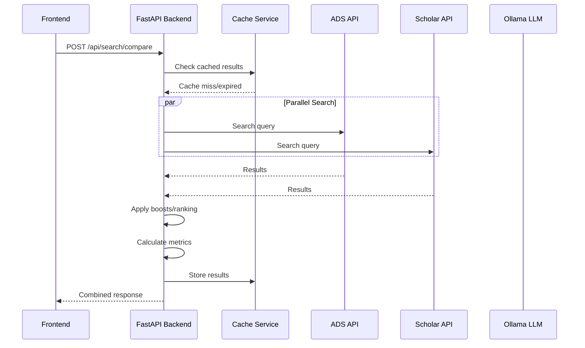
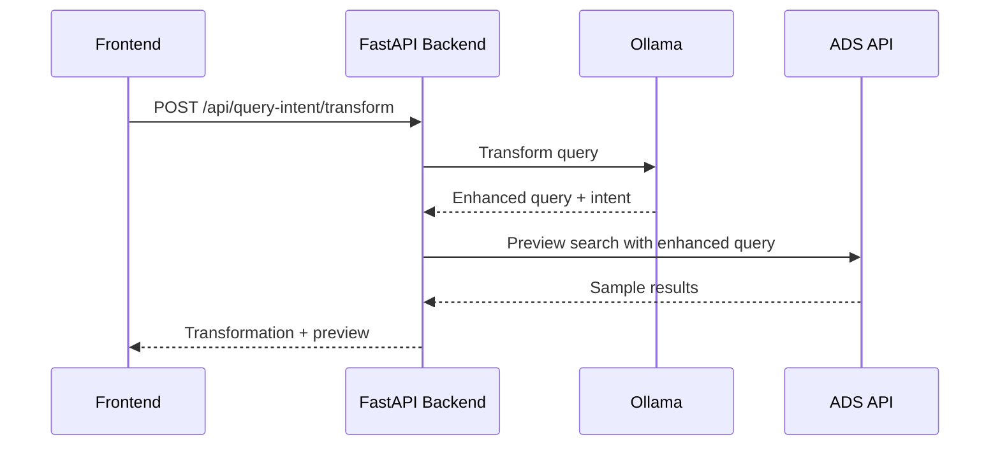

# Search Comparisons Tool - Complete Documentation

## Overview

The Search Comparisons Tool is a comprehensive web application designed to compare search results across multiple scholarly search engines, collect relevance judgments, test changes to the ADS/SciX search experience, and analyze search performance metrics. It serves three primary audiences: users providing relevance judgments, technical staff adding features, and scientists testing algorithm changes.

Note: Most of the relevant search testing will happen under Experiments -> Relevance Judgements or Experiments -> Query Intent.

## Table of Contents

1. [Quick Start Guide](#quick-start-guide)
2. [User Guide: Relevance Judgment Collection](#user-guide-relevance-judgment-collection)
3. [Developer Guide: Adding Features](#developer-guide-adding-features)
4. [Scientist Guide: Algorithm Testing](#scientist-guide-algorithm-testing)
5. [Architecture Overview](#architecture-overview)
6. [Deployment & Maintenance](#deployment--maintenance)
7. [Troubleshooting](#troubleshooting)

---

## Quick Start Guide

### Prerequisites
- Python 3.8+
- Node.js and npm/pnpm
- API keys for external services (ADS, Web of Science, etc.)
- **Ollama** for query intent service (see [LLM Service Issues](#llm-service-issues) for setup)

### Run the frontend and backend
```bash
# Project directory
cd search-comparisons

# Start both frontend and backend (handles all configuration automatically)
./startup_with_logs.sh
```
**Notes:**
- Frontend: http://localhost:3001
- Backend API: http://localhost:8001  
- API Docs: http://localhost:8001/docs

**Stop servers when done:**
```bash
./stop_servers.sh
```

**What the startup script does:**
- Automatically configures frontend-backend connection
- Starts backend on port 8001 and frontend on port 3001
- Creates Python virtual environment if needed
- Sets up environment variables correctly

**Killing the Servers**
If you notice the backend or frontend don't seem to be responding or working properly and want to kill those servers to restart them again, use:
lsof -i:8001
lsof -i:3001

to get the pids for the ports corresponding to the backend and frontend. To kill the process type kill pid where the pid is the one corresponding to the server you want to stop. 

**Prerequisites:**
- Ollama must be installed and running (usually runs as system service)
- If query intent features don't work, see [LLM Service Issues](#llm-service-issues)

### Alternative: Manual Development Separating Front and Backend
```bash
# Backend development
cd backend
python -m uvicorn app.main:app --reload --host 0.0.0.0 --port 8001

# Frontend development (separate terminal)
cd frontend
pnpm install
pnpm dev
```

---

## User Guide: Relevance Judgment Collection

### What You Do
As a relevance judgment user, you evaluate search results from multiple engines to help improve search quality. Your judgments feed into metrics that guide search algorithm development.

### Interface Overview
The interface where judgements are collected is located under Experiments -> Relevance Judgements.

**Search Configuration**
- **Search Query Box**: What you input here gets passed as the query for the academic search engines
- **Information Need Box**: Write a short description about what you hope your query will get you
- **Search Button**: Performs the search across each academic search engine
- **Show Previous Judgements Toggle**: If previous judgements exist for returned records you can turn this on to see 

**Ranking Results**
- **Submit Judgements Button**: Greyed out until you enter judgements. Once you enter judgements you can click this to add the judgements to the database.
- **Export Judgements**: Export recorded judgements as a comprehensive report including other information about the current setup including the query, information need, timestamp, NDCG@10 scores, boost configuration, judgements, and notes.
- **Show/Hide Boost Controls**: You can toggle the boost controls on and off depending on whether you need them to be shown.
- **Comparison Engine Dropdwon**: Select the search engine you want to compare with on the right side including Google Scholar, Web of Science, Semantic Scholar, and SciX Development.
- **Original Results**: Results from ADS/SciX sorted by relevance. Click the v button to pop out the abstract. The record includes the Title, publication year, citation count, collection, a drop down for relevance judgement selection, and a button to 'Add Note' to accompany your judgement score. If 'Show Previous Judgements' is toggled on the record also displays previous judgement scores associated with this record and their source (no labeled source if from the web tool, Quepid if from Quepid).
- **Boosted Results**: Re-ranked results based on modifications to the boost controls available on the left side. No results are displayed by default. To populate the results you need to select 'Run Boost Experiment'. Each result displays title, year, citation count, document type (with color coding), collection, boost score, and relevance judgment controls.
- **XX Results**: Results from the selected Comparison Engine using the drop down menu above. The displayed record information types are identical to the others except for the collection.

**Boost Controls**
- **Run Boost Experiment**: Once you select your boost configuration settings click Run Boost Experiment to populate results in the middle results column under Boosted Results.
- **ADS Query Field Weights**: Boxes to enter in values for author, year, title, abstract, and keyword weights used by the relevance algorithm.
- **Citation Boost**: A boost factor that includes the citation count.
- **Recency Boost**: The first box value controls the overall strength of the recency boost. The second box value controls how quickly the recency boost decays with age.
- **Document Type Boost**: Boxes to enter boost values for various document types. Setting a doctype boost to 0 will completely filter out that document type from the results.
- **Collection Boost**: Boxes to enter boost values for the collections in ADS/SciX.
- **Refereed Boost**: A box to enter a boost factor to boost refereed papers.
- **Boost Weights**: Boxes to enter values to control how much each boost type contributes to the final score including citation count, recency, document type, collection, and whether the paper is refereed.


### Step-by-Step Workflow

#### 1. Starting a Search Comparison
1. Open http://localhost:3001 in your browser
2. Navigate to the "Experiments" tab
3. Stay on the "Relevance Judgements" tab
4. Enter your search query in the search query text box
5. Click the Search button
6. Original Results displayed on the right are the results retrieved from ADS/SciX sorted by relevance for your input query
7. Boosted results by default will not show up until you run a boost experiment
8. The results in the right are modifiable based on the selected Comparison Engine (Google Scholar is default, other options include Semantic Scholar, Web of Science, and SciX Development). 
9. The default number of results is 10 but you can click 'Load More' to load 10 more at a time.

#### 2. Evaluating Results
- **Make sure to provide an information need** it helps us better understand the scores
- **Click the v button to pop out the abstract** please read it and the title before scoring
- **Add a score of 3, 2, 1, or 0**, where 3 is exactly what you wanted, 2 you would be happy with but isn't perfect, 1 is marginally relevant, and 0 is completely irrelevant.
- **Judge at least the first 10 results** per engine
- **Be consistent** with your rating scale across queries
- **Consider your information need**: What are you hoping to see with this query?
- **Focus on content relevance**, not just keyword matching
- **When comparing results** look at the relative NCDG@10 scores to get an idea of which set of results are better for the given query
- **Click Submit Judgements** when you want to add your judgements to the database (all submitted judgements are viewable in the Judgements Database tab)
- **Click Export Judgements** to generate a comprehensive report that includes your recorded judgements, notes, selected configurations, etc.


  ---
  
### Relevance Judgements Database

The Relevance Judgements Database is a comprehensive interface for managing and analyzing all collected relevance judgements. This database is populated when users click the **Submit Judgements** button on the relevance judgements page, storing all evaluation data for analysis and export.

#### Accessing the Database
Navigate to **Experiments → Judgements Database** to view all stored relevance judgements.

#### Key Features

**Filtering and Search:**
- **Query Filter**: Search judgements by the original search query text
- **Rater ID Filter**: Filter by specific evaluator/rater identification
- **Source Filter**: Filter by search engine source (ADS, Google Scholar, Semantic Scholar, Web of Science)
- **Score Filter**: Filter by relevance score (Perfect/1.0, Good/0.67, Fair/0.33, Poor/0.0)

**Data Management:**
- **Individual Deletion**: Remove specific judgements using the delete button on each row
- **Sortable Columns**: Click column headers to sort by query, title, source, score, or date
- **Pagination**: Navigate through large datasets with configurable rows per page

**Export Capabilities:**
- **Export All**: Download complete judgements database in CSV or TXT format
- **Export Filtered**: Export only the currently filtered subset of judgements
- **Smart Filenames**: Exported files include query names or timestamps for easy identification
- **Structured Format**: Exports include query, title, source, score, score label, notes, date, and rater ID

**Display Information:**
Each judgement record shows:
- Original search query
- Paper title and source (with color-coded chips)
- Relevance score with descriptive labels (Perfect, Good, Fair, Poor)
- Evaluation notes (if provided)
- Creation timestamp
- Rater identification

#### Database Schema
The judgements database stores:
- `query`: Original search query text
- `record_title`: Paper/document title
- `record_source`: Search engine source
- `judgement_score`: Numeric relevance score (0, 0.33, 0.67, 1.0)
- `judgement_note`: Optional evaluation notes
- `rater_id`: Evaluator identification
- `created_at`: Timestamp of judgement creation

#### Use Cases
- **Performance Analysis**: Compare search engine effectiveness across different queries
- **Rater Agreement Studies**: Analyze consistency between different evaluators
- **Query-Specific Research**: Export judgements for specific search terms for detailed analysis
- **Algorithm Development**: Use collected judgements to train and validate search ranking improvements
- **Quality Assurance**: Review and clean evaluation data before analysis

  ---

## Similarity Tests: Evaluating ADS Similar() Operator Enhancement

### Overview

The Similarity Tests feature provides a comparative evaluation framework for assessing the effectiveness of the ADS/SciX `similar()` operator against embeddings-based similarity approaches. This experimental tool serves as a testbed for future algorithm improvements and helps guide the transition from the current similar() operator to more efficient embeddings-based methods.

### Current Implementation

The Similarity Tests interface displays side-by-side comparisons between:
- **Set A (ADS similar() operator)**: Traditional similarity results using ADS's current algorithmic approach
- **Set B (Embeddings approach)**: Results generated using modern vector embeddings and cosine similarity

Each comparison includes:
- **Multi-LLM evaluation scores**: Relevance judgments from Claude, Gemini, and DeepSeek models
- **NDCG@10 metrics**: Quantitative ranking quality assessment 
- **Paper metadata**: Full bibliographic information, abstracts, and publication details
- **Interactive scoring interface**: Manual relevance judgment collection capabilities

### Purpose and Testing Scope

Currently, the feature contains placeholder test data based on the comparison paper `2022ApJ...931...44P` ("RESOLVE and ECO: Finding Low-metallicity z ∼ 0 Dwarf AGN Candidates Using Optimized Emission-line Diagnostics"). This serves as a proof-of-concept demonstrating:

1. **Algorithm comparison methodology**: Framework for systematic evaluation of different similarity approaches
2. **Multi-modal evaluation**: Combining LLM-based and human relevance judgments
3. **Performance metrics**: NDCG@10 scoring for ranking quality assessment
4. **User interface design**: Interactive comparison visualization for researchers

### Future Development Roadmap

The Similarity Tests feature is planned for significant expansion to support ADS/SciX's transition to embeddings-based similarity search:

#### Phase 1: Human Evaluation Pipeline Integration
- **Expert reviewer interface**: Streamlined workflow for domain experts to provide relevance judgments
- **Batch evaluation capabilities**: Tools for processing large datasets of similarity comparisons
- **Inter-annotator agreement tracking**: Statistical analysis of judgment consistency across evaluators
- **Ground truth dataset creation**: Building validated similarity benchmarks for various astronomical domains

#### Phase 2: LLM Evaluation Pipeline Enhancement  
- **Multi-model ensemble evaluation**: Expanding beyond the current Claude/Gemini/DeepSeek trio to include specialized scientific LLMs
- **Domain-specific prompt engineering**: Optimizing evaluation prompts for different astronomical subfields (stellar, galactic, cosmology, etc.)
- **Confidence scoring**: Implementing uncertainty measures for LLM-based judgments
- **Automated evaluation workflows**: Continuous assessment of similarity algorithm changes

#### Phase 3: Embeddings Comparison Database
- **Large-scale embeddings repository**: Comprehensive database of paper embeddings across the full ADS corpus
- **Multiple embedding model testing**: Comparative evaluation of different pre-trained models (SciBERT, SpectraBERT, domain-specific variants)
- **Embedding quality metrics**: Intrinsic evaluation measures for embedding representations
- **Performance benchmarking**: Speed and accuracy comparisons between embedding approaches and the current similar() operator

#### Phase 4: Production Integration Planning
- **A/B testing framework**: Infrastructure for gradual rollout of embeddings-based similarity
- **Performance monitoring**: Real-time tracking of similarity search quality and speed improvements
- **Fallback mechanisms**: Robust systems for reverting to the original similar() operator if needed
- **User feedback integration**: Channels for collecting researcher feedback on similarity result quality

### Technical Architecture

The Similarity Tests leverage the existing search comparison infrastructure:
- **Frontend**: React component (`SimilarityTests.js`) with Material-UI interface
- **Backend**: Integration with existing search services and comparison metrics
- **Data storage**: JSON-based test datasets with structured evaluation results
- **API endpoints**: RESTful services for retrieving and storing similarity evaluations

### Research Applications

This feature supports several research initiatives:
1. **Algorithm validation**: Quantitative assessment of similarity algorithm improvements
2. **Domain-specific tuning**: Optimizing similarity measures for different astronomical research areas  
3. **User experience research**: Understanding how researchers interact with and perceive similarity results
4. **Performance optimization**: Identifying bottlenecks and improvement opportunities in similarity search


  ---
  
## Query Intent Feature

The Query Intent tab provides AI-powered query transformation using local LLM models:

1. **Navigate to Experiments → Query Intent**
2. **Enter a natural language query** like:
   - "papers by Stephen Hawking about black holes"
   - "recent work on exoplanets by Mayor"
   - "trending papers on dark matter"
3. **Click "Analyze Intent"** to see:
   - **Intent classification** (author, topic, author_topic, etc.)
   - **Transformed query** using proper ADS search syntax
   - **Explanation** of the transformation
   - **Live search results** from ADS using the improved query

**Examples of transformations:**
- `"papers by Alberto Accomazzi"` → `author:"Accomazzi, A" OR author:"Accomazzi, Alberto"`
- `"Einstein black holes"` → `(author:"Einstein, A" OR author:"Einstein, Albert") AND abs:"black holes"`
- `"trending exoplanets"` → `trending(abs:"exoplanets")`

**Requirements:** Ollama must be running with a compatible model (qwen2:7b or phi:2.7b). The startup script handles configuration automatically.

#### How Query Intent Transformation Works

The system uses **few-shot prompting** with curated examples to teach the LLM how to transform natural language queries into precise ADS search syntax. The LLM learns from these patterns:

**Intent Classification Types:**
- `topic` - Pure subject matter queries
- `author` - Author-only searches  
- `author_year` - Author with specific year
- `author_year_range` - Author with date range
- `author_topic` - Combined author and subject
- `author_topic_influential` - Seeking highly-cited papers
- `topic_trending` - Current/popular papers on topic
- `topic_review` - Review papers on topic
- `similar` - Papers similar to a reference
- `related` - Papers related to a topic

**Key Training Examples:**

| Natural Language | Intent | ADS Query |
|------------------|---------|-----------|
| "papers about black holes" | `topic` | `abs:"black holes"` |
| "papers by Stephanie Jarmak" | `author` | `author:"Jarmak, S" OR author:"Jarmak, Stephanie"` |
| "Jarmak 2020" | `author_year` | `(author:"Jarmak, S" OR author:"Jarmak, Stephanie") AND year:2020` |
| "trending papers on exoplanets" | `topic_trending` | `trending(abs:"exoplanets")` |
| "review papers on dark matter" | `topic_review` | `reviews(abs:"dark matter")` |
| "popular papers by Hawking on black holes" | `author_topic_influential` | `(author:"Hawking, S" OR author:"Hawking, Stephen") AND abs:"black holes"` |

**Critical Transformation Rules:**
1. **Author format**: Always use `author:"Lastname, F" OR author:"Lastname, Firstname"`
2. **Topic separation**: Never mix topics with author fields - use `AND` to combine
3. **Year precision**: Single years use `year:2020`, ranges use `year:[2020 TO 2023]`
4. **Intent modifiers**: Words like "popular", "highly cited" affect sorting, not the query itself
5. **Special operators**: `trending()`, `reviews()`, `similar()`, `related()` for specific searches

**Customizing Examples:**
To modify the training examples, edit [`backend/app/services/query_intent/llm_service.py`](file:///home/scixmuse/search-comparisons/backend/app/services/query_intent/llm_service.py#L355-L409) in the `format_prompt()` method. Add new examples following the same pattern:
```
Original: "your example query"
Intent: classification_type
Explanation: Brief description of what the user wants
Transformed: proper_ads_syntax
```

---

## Developer Guide: Adding Features

Recommendation: Use the AGENT.md file associated with this project with your coding agent of choice (Claude Code, Amp, Copilot, Cursor, etc.) for any modifications to the project. The project was 100% created by AI coding agents, and any questions about or revisions to the codebase should be addressable through best practices using coding agents.

### Architecture Overview
The application follows a modern microservices architecture:

```
Frontend (React + TypeScript + MUI)
↓ HTTP/REST API
Backend (FastAPI + Python)
↓ External APIs
Search Engines (ADS, Google Scholar, etc.) + LLM (Ollama)
```

### Backend Structure
```
backend/app/
├── api/           # Pydantic models and API schemas
├── routes/        # FastAPI route handlers
├── services/      # Business logic and external integrations
├── core/          # Configuration and database setup
├── utils/         # Shared utilities and helpers
└── main.py        # Application entry point
```

### Key Services

#### SearchService (`services/search_service.py`)
Main orchestrator for search operations:
- Coordinates parallel requests to multiple search engines
- Handles fallback logic when engines fail
- Manages caching and timeout behavior
- Delegates to ComparisonService for metrics

#### Individual Engine Services
Each search engine has its own service module:
- `ads_service.py`: ADS/SciX search integration
- `scholar_service.py`: Google Scholar integration
- `semantic_scholar_service.py`: Semantic Scholar API
- `web_of_science_service.py`: Web of Science integration

#### Supporting Services
- `boost_service.py`: Post-retrieval ranking adjustments
- `comparison_service.py`: Metrics calculation (nDCG, Jaccard, etc.)
- `unified_cache_service.py`: In-memory caching with TTL
- `query_intent/service.py`: LLM-powered query transformation

### Adding a New Search Engine

#### 1. Create Service Module
Create `services/your_engine_service.py`:

```python
import asyncio
import logging
from typing import List, Optional
import httpx
from app.api.search_models import SearchResult

logger = logging.getLogger(__name__)

class YourEngineService:
    def __init__(self, api_key: Optional[str] = None):
        self.api_key = api_key
        self.base_url = "https://your-api.example.com"
        self.timeout = 30.0
    
    async def get_your_engine_results(
        self, 
        query: str, 
        fields: List[str],
        max_results: int = 20
    ) -> List[SearchResult]:
        """Fetch results from Your Engine API."""
        try:
            async with httpx.AsyncClient(timeout=self.timeout) as client:
                params = {
                    "q": query,
                    "rows": max_results,
                    "api_key": self.api_key
                }
                
                response = await client.get(
                    f"{self.base_url}/search", 
                    params=params
                )
                response.raise_for_status()
                
                data = response.json()
                return self._parse_results(data)
                
        except Exception as e:
            logger.error(f"Your Engine search failed: {e}")
            return []
    
    def _parse_results(self, data: dict) -> List[SearchResult]:
        """Convert API response to SearchResult objects."""
        results = []
        for item in data.get("results", []):
            result = SearchResult(
                id=item.get("id"),
                title=item.get("title", ""),
                authors=item.get("authors", []),
                abstract=item.get("abstract", ""),
                publication_date=item.get("date"),
                url=item.get("url"),
                citation_count=item.get("citations", 0),
                source="your_engine"
            )
            results.append(result)
        return results
```

#### 2. Register in Main Application
Add to `main.py`:

```python
from app.services.your_engine_service import YourEngineService

# In create_app()
app.state.your_engine_service = YourEngineService(
    api_key=settings.YOUR_ENGINE_API_KEY
)
```

#### 3. Update SearchService Configuration
In `services/search_service.py`, add to `SERVICE_CONFIG`:

```python
SERVICE_CONFIG = {
    "your_engine": {
        "priority": 3,
        "timeout": 30.0,
        "fallback_available": False
    },
    # ... existing configs
}
```

#### 4. Add Frontend Support
In `frontend/src/types/search.ts`, add to the `SearchEngine` enum:

```typescript
export enum SearchEngine {
    ADS = "ads",
    SCHOLAR = "scholar", 
    SEMANTIC_SCHOLAR = "semantic_scholar",
    WEB_OF_SCIENCE = "web_of_science",
    YOUR_ENGINE = "your_engine"
}
```

Update `frontend/src/components/SearchEngineSelector.tsx` to include the new option.

### Customizing Query Intent Transformation

The LLM-powered query transformation system can be customized by modifying the few-shot examples and rules.

#### Modifying Training Examples

Edit [`backend/app/services/query_intent/llm_service.py`](file:///home/scixmuse/search-comparisons/backend/app/services/query_intent/llm_service.py#L355-L409) in the `format_prompt()` method:

```python
# Add new examples to the prompt template
Original: "recent work on asteroids"
Intent: topic_recent
Explanation: Looking for recent papers about asteroids
Transformed: abs:"asteroids" # sorted by recency in post-processing

Original: "highly cited papers on cosmology"  
Intent: topic_influential
Explanation: Looking for influential papers on cosmology
Transformed: abs:"cosmology" # sorted by citation_count in post-processing
```

#### Adding New Intent Classifications

1. **Add new intent type** to the list in the prompt template
2. **Update the parsing logic** in `interpret_query()` to handle the new intent
3. **Add sorting logic** in `search_with_transformed_query()` for intent-specific ranking

#### Testing Query Transformations

Use the API endpoint to test transformations:

```bash
curl -X POST http://localhost:8001/api/intent-transform-query \
  -H "Content-Type: application/json" \
  -d '{"query": "your test query"}'
```

### Adding New Metrics

#### 1. Implement Metric Function
In `services/comparison_service.py`:

```python
def calculate_your_metric(
    results_a: List[SearchResult],
    results_b: List[SearchResult], 
    judgments: Dict[str, float] = None
) -> float:
    """Calculate your custom metric."""
    # Implementation here
    return metric_value
```

#### 2. Register in Metric Switch
Add to the metric calculation switch in `ComparisonService.compare_results()`:

```python
elif metric == "your_metric":
    value = self.calculate_your_metric(results_a, results_b, judgments)
```

#### 3. Update Frontend
Add to `frontend/src/components/MetricSelector.tsx`:

```typescript
const availableMetrics = [
    { value: "jaccard", label: "Jaccard Similarity" },
    { value: "ndcg", label: "nDCG@10" },
    { value: "your_metric", label: "Your Metric" }
];
```

### Adding Boost/Ranking Experiments

Boost configurations allow post-retrieval re-ranking of search results and filtering by document type. 

#### Boost Filtering Behavior

- **Document Type Filtering**: Setting a doctype boost value to 0 will completely filter out that document type from results
- **Collection Filtering**: Setting a collection boost value to 0 will filter out papers from that collection
- **Filtered Results Count**: The API response includes a `results_filtered` count showing how many results were removed by filtering

Add new boost types in `services/boost_service.py`:

```python
def apply_your_boost(
    results: List[SearchResult], 
    boost_factor: float
) -> List[SearchResult]:
    """Apply your custom boost to results."""
    for result in results:
        # Calculate boost score
        boost_score = calculate_your_boost_score(result, boost_factor)
        result.boost_score = boost_score
    
    # Re-sort by boost score
    return sorted(results, key=lambda x: x.boost_score, reverse=True)
```

Register in `apply_all_boosts()`:

```python
if boost_config.your_boost:
    results = apply_your_boost(results, boost_config.your_boost)
```

### Testing

#### Unit Tests
Create tests in `backend/tests/test_services/`:

```python
import pytest
from app.services.your_engine_service import YourEngineService

@pytest.mark.asyncio
async def test_your_engine_search():
    service = YourEngineService(api_key="test_key")
    results = await service.get_your_engine_results(
        query="test query",
        fields=["title", "author"],
        max_results=10
    )
    assert isinstance(results, list)
    assert len(results) <= 10
```

#### Integration Tests
Test the full API endpoint:

```python
def test_search_with_your_engine(client):
    response = client.post("/api/search/compare", json={
        "query": "test query",
        "sources": ["ads", "your_engine"],
        "max_results": 10
    })
    assert response.status_code == 200
    data = response.json()
    assert "your_engine" in data["results"]
```

#### Run Tests
```bash
# All tests
pytest backend/tests/

# Specific test file
pytest backend/tests/test_services/test_your_engine_service.py

# With coverage
pytest backend/tests/ --cov=backend/app --cov-report=html
```

---

## Scientist Guide: Algorithm Testing

Note: To test changes to boost factors, compare ADS/SciX production results to development or other search engines, the interface is located by clicking the Experiments tab and running a search under the Relevance Judgements tab.

### Overview
This tool enables systematic comparison of search algorithms, ranking functions, and parameter configurations across multiple search engines. You can test hypotheses about search relevance and collect quantitative metrics.

### Key Capabilities
- **Parallel multi-engine search**: Compare ADS, Google Scholar, Semantic Scholar, Web of Science
- **Configurable ranking boosts**: Citation count, recency, document type, field weights
- **LLM query transformation**: Test query rewriting effectiveness
- **Relevance metrics**: nDCG, precision, recall, Jaccard similarity


### API Reference

#### Core Search Endpoint
**POST** `/api/search/compare`

```json
{
  "query": "machine learning astrophysics",
  "sources": ["ads", "scholar", "semantic_scholar"],
  "metrics": ["ndcg@10", "precision@10", "jaccard@10"],
  "fields": ["title", "author", "abstract", "citation_count"],
  "max_results": 50,
  "useTransformedQuery": true,
  "originalQuery": "machine learning astrophysics", 
  "boost_config": {
    "citation_boost": 1.5,
    "recency_boost": 0.8,
    "doctype_boosts": {
      "article": 1.0,
      "inproceedings": 0.9,
      "phdthesis": 0.7
    },
    "field_boosts": {
      "keyword": 0.5,
      "abstract": 0.3
    },
    "adsQueryFields": {
      "title": 50,
      "author": 30,
      "keyword": 20
    }
  }
}
```

**Response:**
```json
{
  "results": {
    "ads": [
      {
        "id": "2023arXiv230512345H",
        "title": "Machine Learning Applications in Astrophysics",
        "authors": ["Smith, J.", "Doe, A."],
        "abstract": "...",
        "citation_count": 45,
        "publication_date": "2023-05-15",
        "url": "https://ui.adsabs.harvard.edu/abs/2023arXiv230512345H",
        "source": "ads",
        "score": 0.95,
        "boost_score": 1.42
      }
    ],
    "scholar": [...],
    "semantic_scholar": [...]
  },
  "comparison": {
    "ndcg@10": {
      "ads": 0.762,
      "scholar": 0.543,
      "semantic_scholar": 0.691
    },
    "precision@10": {
      "ads": 0.8,
      "scholar": 0.6, 
      "semantic_scholar": 0.7
    },
    "jaccard@10": {
      "ads_scholar": 0.23,
      "ads_semantic_scholar": 0.31,
      "scholar_semantic_scholar": 0.18
    }
  },
  "field_weights": {
    "qf": "title^50 author^30 keyword^20",
    "field_boosts": {
      "keyword": 0.5,
      "abstract": 0.3
    }
  }
}
```

#### Query Intent Transformation
**POST** `/api/query-intent/transform`

*Note: Requires Ollama server running locally. See [LLM Service Issues](#llm-service-issues) for setup.*

```json
{
  "query": "exoplanet atmospheres"
}
```

**Response:**
```json
{
  "transformed_query": "exoplanet atmosphere composition spectroscopy transit",
  "intent": "research_specific",
  "confidence": 0.87,
  "explanation": "Added domain-specific terms for atmospheric research",
  "ads_preview": {
    "num_found": 1247,
    "top_results": [...]
  }
}
```

#### Retrieving Judgments
**GET** `/api/quepid/judgments/{case_id}?query=exoplanet%20atmospheres`

Returns relevance judgments for computing metrics:
```json
{
  "judgments": {
    "2023ApJ...123..456B": 3,
    "2022A&A...789..012C": 2,
    "2021MNRAS.456..789D": 1,
    "2020AJ....159..123E": 0
  }
}
```

### Experimental Design Patterns

#### 1. Parameter Sweep Experiments
Test different boost configurations systematically:

```python
import requests
import pandas as pd
from itertools import product

# Define parameter ranges
citation_boosts = [1.0, 1.2, 1.5, 2.0]
recency_boosts = [0.5, 0.8, 1.0, 1.2]
queries = ["exoplanet atmospheres", "dark matter", "gravitational waves"]

results = []

for query, cite_boost, rec_boost in product(queries, citation_boosts, recency_boosts):
    config = {
        "query": query,
        "sources": ["ads", "scholar"],
        "metrics": ["ndcg@10", "precision@10"],
        "boost_config": {
            "citation_boost": cite_boost,
            "recency_boost": rec_boost
        }
    }
    
    response = requests.post("http://localhost:8001/api/search/compare", json=config)
    data = response.json()
    
    results.append({
        "query": query,
        "citation_boost": cite_boost,
        "recency_boost": rec_boost,
        "ads_ndcg": data["comparison"]["ndcg@10"]["ads"],
        "scholar_ndcg": data["comparison"]["ndcg@10"]["scholar"]
    })

# Analyze results
df = pd.DataFrame(results)
best_config = df.loc[df["ads_ndcg"].idxmax()]
print(f"Best configuration: {best_config}")
```

#### 2. A/B Testing Query Transformations
Compare original vs. transformed queries:

```python
queries = ["machine learning", "stellar evolution", "cosmic rays"]
results = []

for query in queries:
    # Test original query
    original_config = {
        "query": query,
        "sources": ["ads"],
        "useTransformedQuery": False,
        "metrics": ["ndcg@10"]
    }
    
    # Test transformed query  
    transformed_config = {
        "query": query,
        "sources": ["ads"],
        "useTransformedQuery": True,
        "metrics": ["ndcg@10"]
    }
    
    original_response = requests.post("http://localhost:8001/api/search/compare", json=original_config)
    transformed_response = requests.post("http://localhost:8001/api/search/compare", json=transformed_config)
    
    results.append({
        "query": query,
        "original_ndcg": original_response.json()["comparison"]["ndcg@10"]["ads"],
        "transformed_ndcg": transformed_response.json()["comparison"]["ndcg@10"]["ads"],
        "improvement": transformed_response.json()["comparison"]["ndcg@10"]["ads"] - 
                      original_response.json()["comparison"]["ndcg@10"]["ads"]
    })

df = pd.DataFrame(results)
print(f"Average improvement: {df['improvement'].mean():.3f}")
```

#### 3. Solr Field Weight Optimization
Test different Solr qf configurations:

```python
field_configs = [
    {"title": 50, "author": 30, "keyword": 20},
    {"title": 80, "author": 20, "keyword": 10}, 
    {"title": 30, "author": 50, "keyword": 30},
    {"title": 60, "author": 40, "abstract": 20}
]

for config in field_configs:
    request_config = {
        "query": "neutron star mergers",
        "sources": ["ads"],
        "metrics": ["ndcg@10", "precision@10"],
        "boost_config": {
            "adsQueryFields": config
        }
    }
    
    response = requests.post("http://localhost:8001/api/search/compare", json=request_config)
    data = response.json()
    
    print(f"Config {config}: nDCG={data['comparison']['ndcg@10']['ads']:.3f}")
```

### Boost Configuration Implementation

The boost configurations are applied in the backend through several key components that modify relevance scores based on different parameters.

#### Field Boost Implementation

ADS Query Field Weights are transformed into Solr query syntax:

```python
# backend/app/services/query_transformation.py
def transform_query_with_boosts(query: str, field_boosts: Dict[str, float]) -> str:
    """Transform a query by applying field boosts and generating combinations."""
    if not query or not field_boosts:
        return query

    # Sort fields by boost value in descending order
    sorted_fields = sorted(field_boosts.items(), key=lambda x: (-x[1], x[0]))
    
    parts = []
    
    # Process each field in order of boost value
    for field, boost in sorted_fields:
        # Add single terms with field boost
        for term in terms:
            parts.append(f'{field}:{term}^{boost}')
            
        # Add phrase combinations with field boost
        for phrase in phrases:
            parts.append(f'{field}:"{phrase}"^{boost}')

    return ' OR '.join(parts)
```

#### Citation Count Boost Implementation

Citation boost uses log scaling based on collection and publication year:

```python
# backend/app/services/boost_service.py
def calculate_citation_boost(
    citation_count: int,
    collection: str,
    pub_year: int,
    citation_distributions: Dict[str, Dict[int, Dict[str, float]]]
) -> float:
    """Calculate citation boost based on citation count."""
    try:
        # Get distribution for collection and year
        dist = citation_distributions.get(collection, {}).get(pub_year, {})
        median = dist.get('median', 0)
        
        if median == 0:
            return 0.0
            
        # Calculate boost relative to median using log scale
        return math.log1p(citation_count / median)
    except Exception as e:
        logger.error(f"Error calculating citation boost: {str(e)}")
        return 0.0
```

#### Recency Boost Implementation

Recency boost uses reciprocal function based on publication age:

```python
# backend/app/services/boost_service.py
def calculate_recency_boost(pubdate: str, multiplier: float = 1.0) -> float:
    """Calculate recency boost using reciprocal function."""
    try:
        # Parse publication date
        pub_date = parse(pubdate)
        now = datetime.now()
        
        # Calculate age in months
        age_months = ((now.year - pub_date.year) * 12 + 
                     (now.month - pub_date.month))
        
        # Apply reciprocal function: 1 / (1 + multiplier * age_months)
        return 1.0 / (1.0 + multiplier * age_months)
    except (ValueError, TypeError):
        logger.warning(f"Invalid publication date: {pubdate}")
        return 0.0
```

#### Document Type Boost Implementation

Document type boost uses rank-based even distribution:

```python
# backend/app/services/boost_service.py
DEFAULT_DOCTYPE_RANKS = {
    'article': 1,      # Journal article
    'eprint': 1,       # Article preprinted in arXiv
    'inproceedings': 2,# Article appearing in conference proceedings
    'abstract': 5,     # Meeting abstract
    'book': 1,         # Book (monograph)
    'phdthesis': 3,    # PhD thesis
    'misc': 8,         # Anything not in the above list
    # ... more types
}

def calculate_doctype_boost(doctype: str, doctype_ranks: Dict[str, int] = None) -> float:
    """Calculate document type boost based on rank using even distribution."""
    doctype_ranks = doctype_ranks or DEFAULT_DOCTYPE_RANKS
    rank = doctype_ranks.get(doctype.lower(), doctype_ranks['other'])
    
    # Get unique ranks and sort them
    unique_ranks = sorted(set(doctype_ranks.values()))
    
    # Calculate boost factor using even distribution
    rank_index = unique_ranks.index(rank)
    num_unique_ranks = len(unique_ranks)
    
    if num_unique_ranks <= 1:
        return 1.0
        
    return 1.0 - (rank_index / (num_unique_ranks - 1))
```

#### Collection Boost Implementation

Collection boost handles multi-collection papers with averaging:

```python
# backend/app/services/boost_service.py
def calculate_collection_boost(collection: str, collection_boosts: Dict[str, float]) -> float:
    """Calculate collection boost based on numerical multipliers."""
    if not collection or not collection_boosts:
        return 1.0
    
    # Handle multiple collections separated by comma
    collections = [c.strip().lower() for c in collection.split(',')]
    
    total_boost = 0.0
    num_collections = len(collections)
    
    for coll in collections:
        boost = collection_boosts.get(coll, 1.0)
        total_boost += boost
    
    # For single collections, filter out if boost is 0.0
    if num_collections == 1:
        if total_boost == 0.0:
            return 0.0  # Filter out single collection with 0.0 boost
        return total_boost
    
    # For multiple collections, return the average
    return total_boost / num_collections
```

#### Boost Combination Methods

All individual boosts are combined using configurable methods:

```python
# backend/app/services/boost_service.py
def combine_boost_factors(
    boosts: Dict[str, float],
    weights: Dict[str, float] = None,
    combination_method: str = 'weighted_sum'
) -> float:
    """Combine boost factors using the specified combination method."""
    if combination_method == 'simple_product':
        # Multiply all boosts together
        return math.prod(valid_boosts.values())
        
    elif combination_method == 'simple_sum':
        # Add all boosts together
        return sum(valid_boosts.values())
        
    elif combination_method == 'weighted_geometric_mean':
        # Calculate weighted geometric mean
        weighted_products = [
            math.pow(valid_boosts.get(boost_type, 0.0), weight)
            for boost_type, weight in weights.items()
            if valid_boosts.get(boost_type, 0.0) > 0
        ]
        return math.prod(weighted_products)
        
    else:  # weighted_sum (default)
        # Calculate weighted sum
        return sum(
            valid_boosts.get(boost_type, 0.0) * weight
            for boost_type, weight in weights.items()
        )

# Default boost weights
DEFAULT_BOOST_WEIGHTS = {
    'citation': 0.3,
    'recency': 0.3,
    'doctype': 0.2,
    'collection': 0.1,
    'refereed': 0.1
}
```

#### Main Boost Application Function

All boosts are applied together in the main function:

```python
# backend/app/services/boost_service.py
async def apply_all_boosts(
    results: List[SearchResult],
    boost_config: Dict[str, Any],
    citation_distributions: Dict[str, Dict[int, Dict[str, float]]] = None
) -> List[SearchResult]:
    """Apply all configured boost factors to search results."""
    
    for i, result in enumerate(boosted_results):
        # Initialize boost factors
        boosts = {}
        
        # Citation boost
        if citation_boost > 0:
            base_boost = calculate_citation_boost(
                result.citation_count or 0,
                result.collection or 'general',
                result.year,
                citation_distributions or {}
            )
            boosts['citation'] = base_boost * citation_boost
        
        # Recency boost
        if recency_boost > 0 and result.pubdate:
            base_boost = calculate_recency_boost(
                result.pubdate,
                recency_multiplier
            )
            boosts['recency'] = base_boost * recency_boost
        
        # Document type boost
        if doctype_boosts:
            base_boost = calculate_doctype_boost(
                result.doctype,
                doctype_boosts
            )
            boosts['doctype'] = base_boost
        
        # Collection boost
        base_boost = calculate_collection_boost(
            result.collection,
            collection_boosts
        )
        boosts['collection'] = base_boost
        
        # Combine boost factors
        final_boost = combine_boost_factors(
            boosts, 
            boost_weights,
            combination_method
        )
        
        # Apply final boost to score
        boost_multiplier = math.exp(final_boost)
        result._score *= boost_multiplier
        result.boosted_score = result._score
```

### Advanced Configurations

#### Document Type Preferences
Adjust ranking based on publication type:

```json
{
  "boost_config": {
    "doctype_boosts": {
      "article": 1.0,
      "inproceedings": 0.9,
      "book": 0.8,
      "phdthesis": 0.7,
      "mastersthesis": 0.5,
      "misc": 0.3
    }
  }
}
```

#### Time-Based Boosting
Prefer recent publications:

```json
{
  "boost_config": {
    "recency_boost": 1.5,  # Boost recent papers
    "recency_window_years": 5  # Only boost papers from last 5 years
  }
}
```

#### Combined Field and Citation Boosting
```json
{
  "boost_config": {
    "citation_boost": 1.3,
    "field_boosts": {
      "keyword": 0.8,
      "abstract": 0.5
    },
    "adsQueryFields": {
      "title": 60,
      "author": 40,
      "keyword": 25,
      "abstract": 15
    }
  }
}
```

### Metrics Interpretation

#### nDCG (Normalized Discounted Cumulative Gain)
- **Range**: 0.0 to 1.0 (higher is better)
- **Interpretation**: 
  - 0.8+: Excellent ranking
  - 0.6-0.8: Good ranking  
  - 0.4-0.6: Fair ranking
  - <0.4: Poor ranking
- **Use case**: Overall ranking quality assessment

#### Precision@K
- **Range**: 0.0 to 1.0 (higher is better)
- **Interpretation**: Fraction of top-K results that are relevant
- **Use case**: Quality of top results

#### Recall@K  
- **Range**: 0.0 to 1.0 (higher is better)
- **Interpretation**: Fraction of all relevant documents found in top-K
- **Use case**: Completeness of search

#### Jaccard Similarity
- **Range**: 0.0 to 1.0 (higher means more overlap)
- **Interpretation**: 
  - 0.3+: High overlap between engines
  - 0.1-0.3: Moderate overlap
  - <0.1: Low overlap (engines finding different results)
- **Use case**: Engine diversity analysis

### Reproducibility and Versioning

#### Experiment Configuration Files
Save configurations as JSON for reproducibility:

```json
{
  "experiment_name": "citation_boost_sweep_2024_01",
  "description": "Testing citation boost effects on nDCG",
  "timestamp": "2024-01-15T10:30:00Z",
  "git_commit": "a1b2c3d4",
  "test_queries": [
    "exoplanet atmospheres",
    "dark matter detection", 
    "gravitational wave astronomy"
  ],
  "boost_config": {
    "citation_boost": 1.5,
    "recency_boost": 0.8,
    "adsQueryFields": {
      "title": 50,
      "author": 30
    }
  },
  "expected_results": {
    "avg_ndcg_improvement": 0.05
  }
}
```

#### Cache Management
For reproducible experiments:

```python
# Disable cache for fresh results
import requests

# Clear cache (requires restart)
requests.post("http://localhost:8001/api/admin/clear-cache")

# Or use cache-busting parameter
config["cache_bust"] = "experiment_2024_01_v2"
```

### Statistical Analysis

#### Significance Testing
```python
from scipy import stats
import numpy as np

# Compare two configurations
config_a_scores = [0.75, 0.68, 0.82, 0.71, 0.79]  # nDCG scores
config_b_scores = [0.78, 0.72, 0.85, 0.74, 0.81]

# Paired t-test
t_stat, p_value = stats.ttest_rel(config_b_scores, config_a_scores)
print(f"T-statistic: {t_stat:.3f}")
print(f"P-value: {p_value:.3f}")
print(f"Significant improvement: {p_value < 0.05}")
```

#### Effect Size Calculation
```python
def cohen_d(group1, group2):
    """Calculate Cohen's d for effect size."""
    pooled_std = np.sqrt(((len(group1) - 1) * np.var(group1, ddof=1) + 
                         (len(group2) - 1) * np.var(group2, ddof=1)) / 
                        (len(group1) + len(group2) - 2))
    return (np.mean(group1) - np.mean(group2)) / pooled_std

effect_size = cohen_d(config_b_scores, config_a_scores)
print(f"Effect size (Cohen's d): {effect_size:.3f}")
```

---

## Architecture Overview

### System Components

#### Frontend (React + TypeScript)
- **Framework**: React 18 with Vite build system
- **UI Library**: Material-UI (MUI) for components
- **State Management**: Local component state + Context API
- **Routing**: React Router for navigation
- **API Client**: Axios for HTTP requests

**Key Components:**
- `SearchComparison.tsx`: Main search interface
- `QueryIntent.tsx`: LLM query transformation interface  
- `MetricsDashboard.tsx`: Results analysis and visualization
- `ResultCard.tsx`: Individual search result display with judgment controls

#### Backend (FastAPI + Python)
- **Framework**: FastAPI with async/await support
- **Database**: SQLite for local storage, Quepid integration for judgments
- **Caching**: In-memory LRU cache with TTL
- **HTTP Client**: httpx for async external API calls
- **LLM Integration**: Ollama for local language models

**Service Architecture:**
```
┌─────────────────┐    ┌─────────────────┐    ┌─────────────────┐
│   SearchService │────│  ComparisonSvc  │────│   BoostService  │
└─────────────────┘    └─────────────────┘    └─────────────────┘
         │                       │                       │
         ▼                       ▼                       ▼
┌─────────────────┐    ┌─────────────────┐    ┌─────────────────┐
│   ADS Service   │    │ Scholar Service │    │   Cache Service │
└─────────────────┘    └─────────────────┘    └─────────────────┘
```

#### External Integrations
- **ADS API**: Harvard's Astrophysics Data System
- **Google Scholar**: Academic search (API + scraping fallback)
- **Semantic Scholar**: AI-powered academic search
- **Web of Science**: Thomson Reuters academic database
- **Ollama**: Local LLM inference for query transformation

### Data Flow

#### Search Request Flow


#### Query Intent Flow


### Data Models

#### Core SearchResult Model
```python
class SearchResult(BaseModel):
    id: str
    title: str
    authors: List[str]
    abstract: Optional[str]
    publication_date: Optional[str]
    url: Optional[str]
    citation_count: Optional[int]
    source: str
    score: Optional[float]
    boost_score: Optional[float]
    metadata: Dict[str, Any] = {}
```

#### BoostConfig Model
```python
class BoostConfig(BaseModel):
    citation_boost: Optional[float] = 1.0
    recency_boost: Optional[float] = 1.0
    doctype_boosts: Optional[Dict[str, float]] = {}
    field_boosts: Optional[Dict[str, float]] = {}
    adsQueryFields: Optional[Dict[str, int]] = {}
```

#### SearchRequest Model
```python
class SearchRequestWithBoosts(BaseModel):
    query: str
    sources: List[str] = ["ads", "scholar"]
    metrics: List[str] = ["ndcg@10"]
    fields: List[str] = ["title", "author", "abstract"]
    max_results: int = 20
    useTransformedQuery: bool = False
    originalQuery: Optional[str] = None
    boost_config: Optional[BoostConfig] = None
```

### Security Considerations

#### API Key Management
- Store API keys in environment variables
- Use separate keys for development/production
- Implement key rotation procedures
- Monitor API usage and rate limits

#### CORS Configuration
- Restrict origins in production
- Configure appropriate headers
- Validate content types

#### Rate Limiting
- Implement per-IP rate limiting
- Set reasonable request size limits
- Monitor for abuse patterns

#### Data Privacy
- No persistent storage of search queries in logs
- Anonymize user judgment data
- Secure external API communications

---

## Deployment & Maintenance

### Production Deployment

#### Docker Compose (Recommended)
```yaml
version: '3.8'
services:
  backend:
    build: 
      context: ./backend
      dockerfile: Dockerfile
    ports:
      - "8001:8000"
    environment:
      - ADS_API_KEY=${ADS_API_KEY}
      - WEB_OF_SCIENCE_API_KEY=${WEB_OF_SCIENCE_API_KEY}
      - QUEPID_API_TOKEN=${QUEPID_API_TOKEN}
      - LOG_LEVEL=INFO
    volumes:
      - ./backend/logs:/app/logs
    
  frontend:
    build:
      context: ./frontend
      dockerfile: Dockerfile
    ports:
      - "3001:80"
    depends_on:
      - backend
    
  ollama:
    image: ollama/ollama:latest
    ports:
      - "11434:11434"
    volumes:
      - ollama_data:/root/.ollama
    environment:
      - OLLAMA_HOST=0.0.0.0

volumes:
  ollama_data:
```

#### Environment Configuration
The environment variable already exists in backend/.env, but in case anything happens to it:
Create a `.env` file:
```bash
# Required API Keys
ADS_API_KEY=your_ads_api_key_here
WEB_OF_SCIENCE_API_KEY=your_wos_key_here
QUEPID_API_TOKEN=your_quepid_token_here

# Optional Configuration
LOG_LEVEL=INFO
CACHE_TTL_SECONDS=3600
MAX_CACHE_SIZE=1000
OLLAMA_BASE_URL=http://ollama:11434

# Frontend Configuration
REACT_APP_API_URL=http://localhost:8001
REACT_APP_ENVIRONMENT=production
```

### Monitoring and Logging

#### Application Logs
```python
# Configure logging in backend/app/core/config.py
import logging
from logging.handlers import RotatingFileHandler

# Rotating file handler
file_handler = RotatingFileHandler(
    'logs/app.log', 
    maxBytes=10485760,  # 10MB
    backupCount=5
)
file_handler.setFormatter(logging.Formatter(
    '%(asctime)s %(levelname)s %(name)s %(message)s'
))

# Console handler
console_handler = logging.StreamHandler()
console_handler.setFormatter(logging.Formatter(
    '%(asctime)s %(levelname)s %(name)s %(message)s'
))

# Root logger
root_logger = logging.getLogger()
root_logger.setLevel(logging.INFO)
root_logger.addHandler(file_handler)
root_logger.addHandler(console_handler)
```

#### Key Metrics to Monitor
- **API Response Times**: Track latency for each search engine
- **Error Rates**: Monitor failed requests and external API errors
- **Cache Hit Rates**: Optimize caching effectiveness
- **Search Engine Availability**: Track uptime of external services
- **Query Volume**: Monitor usage patterns
- **Judgment Collection Rate**: Track relevance evaluation progress

#### Health Check Endpoints
```python
@app.get("/health")
async def health_check():
    """Basic health check endpoint."""
    return {"status": "healthy", "timestamp": datetime.utcnow()}

@app.get("/health/deep")
async def deep_health_check():
    """Comprehensive health check including external services."""
    checks = {}
    
    # Check database connection
    try:
        # Database check logic
        checks["database"] = "healthy"
    except Exception:
        checks["database"] = "unhealthy"
    
    # Check external APIs
    for service in ["ads", "scholar", "semantic_scholar"]:
        try:
            # Service availability check
            checks[service] = "healthy"
        except Exception:
            checks[service] = "unhealthy"
    
    return {"checks": checks, "timestamp": datetime.utcnow()}
```

### Backup and Recovery

#### Database Backup
```bash
# Backup SQLite database (if using local storage)
cp backend/app.db backup/app_$(date +%Y%m%d_%H%M%S).db

# Backup Quepid judgments (via API)
curl -H "Authorization: Bearer $QUEPID_API_TOKEN" \
     "https://quepid.com/api/cases/$CASE_ID/judgements" \
     > backup/judgments_$(date +%Y%m%d).json
```

#### Configuration Backup
```bash
# Backup environment and configuration
tar -czf backup/config_$(date +%Y%m%d).tar.gz \
    .env docker-compose.yml backend/app/core/config.py
```

### Performance Optimization

#### Backend Optimizations
```python
# Connection pooling for external APIs
import httpx

class OptimizedHTTPService:
    def __init__(self):
        self.client = httpx.AsyncClient(
            timeout=30.0,
            limits=httpx.Limits(
                max_keepalive_connections=20,
                max_connections=100
            )
        )
    
    async def close(self):
        await self.client.aclose()

# Cache optimization
from functools import lru_cache
from typing import Optional

@lru_cache(maxsize=1000)
def expensive_computation(param: str) -> str:
    # Cached expensive operations
    pass
```

#### Frontend Optimizations
```typescript
// Lazy loading of components
import { lazy, Suspense } from 'react';

const MetricsDashboard = lazy(() => import('./MetricsDashboard'));

// Memoization for expensive renders
import { memo, useMemo } from 'react';

const ResultCard = memo(({ result }: { result: SearchResult }) => {
  const formattedAuthors = useMemo(
    () => result.authors.join(', '),
    [result.authors]
  );
  
  return <div>{/* Component JSX */}</div>;
});
```

#### Database Optimizations
```sql
-- Index frequently queried fields
CREATE INDEX idx_search_results_source ON search_results(source);
CREATE INDEX idx_search_results_query ON search_results(query_hash);
CREATE INDEX idx_judgments_query_doc ON judgments(query_id, document_id);
```

---

## Recent Updates

### Frontend Title Overlap Calculation Implementation (January 2025)

**Issue:** The backend's title overlap calculation was failing to find matches between search engines, consistently returning zero overlap counts even when visual inspection revealed matching papers.

**Root Cause:** Backend string matching was too strict and couldn't handle minor differences in title formatting, character encoding, or spacing that are common between different search engines.

**Solution Implemented:** Frontend-based title overlap calculation with robust normalization:

1. **Title Normalization Logic**:
   - Convert to lowercase for case-insensitive matching
   - Remove special characters and punctuation using regex `[^\w\s]`
   - Normalize multiple consecutive spaces to single spaces
   - Trim whitespace from both ends
   - Handle null/undefined titles gracefully

2. **Overlap Calculation**:
   - Extract top 10 results from each search engine
   - Apply normalization to all titles
   - Filter out empty/null titles
   - Use JavaScript Set intersection to find matches
   - Return count of unique matching titles

3. **Implementation Location**:
   - **Main Search Page**: Added to `frontend/src/App.js` (lines 124-160, 919-931)
   - **Boost Experiment Page**: Previously working in `frontend/src/components/BoostExperiment.js`
   - Functions: `normalizeTitle()` and `calculateTitleOverlap()`

4. **Integration Points**:
   - Main search comparison table: Replaces backend `stats.overlap` with `frontendOverlap`
   - Boost experiment headers: Shows overlap counts in column headers
   - Both pages now use identical logic for consistency

**Result:** Title overlap counts now accurately reflect matching papers between search engines, with the "Total Overlap" column showing correct values instead of zero.

**Technical Implementation:**
```javascript
const normalizeTitle = (title) => {
  if (!title) return '';
  return String(title).toLowerCase()
    .replace(/[^\w\s]/g, '')  // Remove special chars
    .replace(/\s+/g, ' ')     // Normalize spaces
    .trim();
};

const calculateTitleOverlap = (results1, results2) => {
  const titles1 = results1.slice(0, 10)
    .map(result => normalizeTitle(result.title))
    .filter(title => title);
  const titles2 = results2.slice(0, 10)
    .map(result => normalizeTitle(result.title))
    .filter(title => title);
  
  const titleSet1 = new Set(titles1);
  const titleSet2 = new Set(titles2);
  const intersection = new Set([...titleSet1].filter(title => titleSet2.has(title)));
  return intersection.size;
};
```

### SciX Development Integration Fix (January 2025)

**Issue:** SciX Development results were not appearing in the relevance judgments experiment due to a JavaScript error and missing integration.

**Root Cause:** The `updateJudgmentCounts` function in `BoostExperiment.js` was missing the `sciXDev` property initialization, causing a `TypeError` when the component tried to access `newCounts.sciXDev`.

**Fix Applied:**
1. **JavaScript Error Resolution**: Added `sciXDev: { quepid: 0, manual: 0, total: 0 }` to the `newCounts` object initialization in `updateJudgmentCounts` function (line 1196).

2. **Complete SciX Development Integration**:
   - Added SciX Development to NDCG calculations in `allNdcgValues` array (line 1265)
   - Included SciX Development results in CSV export functionality (around line 1675)
   - Added SciX Development NDCG scores to CSV export detailed report (line 1793)
   - Integrated SciX Development into batch judgment submission function (around line 2250)

**Files Modified:**
- `frontend/src/components/BoostExperiment.js`: Primary fix location with multiple integration points

**Result:** SciX Development now appears as a functional comparison option in the relevance judgments interface, with full support for scoring, export, and batch operations.

---

## Troubleshooting

### Common Issues and Solutions

#### External API Failures
```python
# Implement circuit breaker pattern
class CircuitBreaker:
    def __init__(self, failure_threshold=5, recovery_timeout=60):
        self.failure_threshold = failure_threshold
        self.recovery_timeout = recovery_timeout
        self.failure_count = 0
        self.last_failure_time = None
        self.state = "CLOSED"  # CLOSED, OPEN, HALF_OPEN
    
    async def call(self, func, *args, **kwargs):
        if self.state == "OPEN":
            if time.time() - self.last_failure_time > self.recovery_timeout:
                self.state = "HALF_OPEN"
            else:
                raise Exception("Circuit breaker is OPEN")
        
        try:
            result = await func(*args, **kwargs)
            self.success()
            return result
        except Exception as e:
            self.failure()
            raise e
    
    def success(self):
        self.failure_count = 0
        self.state = "CLOSED"
    
    def failure(self):
        self.failure_count += 1
        self.last_failure_time = time.time()
        if self.failure_count >= self.failure_threshold:
            self.state = "OPEN"
```

#### Memory Issues
```python
# Memory monitoring
import psutil

@app.middleware("http")
async def memory_monitor(request, call_next):
    process = psutil.Process()
    memory_before = process.memory_info().rss / 1024 / 1024  # MB
    
    response = await call_next(request)
    
    memory_after = process.memory_info().rss / 1024 / 1024  # MB
    if memory_after - memory_before > 50:  # 50MB increase
        logger.warning(f"High memory usage increase: {memory_after - memory_before:.2f}MB")
    
    return response
```

#### Cache Issues
```python
# Cache debugging
def cache_stats():
    """Return cache statistics for monitoring."""
    return {
        "size": len(cache._data),
        "hits": cache.hits,
        "misses": cache.misses,
        "hit_rate": cache.hits / (cache.hits + cache.misses) if (cache.hits + cache.misses) > 0 else 0
    }

@app.get("/api/admin/cache/stats")
async def get_cache_stats():
    return cache_stats()

@app.post("/api/admin/cache/clear")
async def clear_cache():
    cache.clear()
    return {"message": "Cache cleared"}

#### API Connection Issues

**Problem**: External search engines returning errors or timeouts
```

ERROR: ADS API request failed: HTTPStatusError 429

**Solutions**:
1. Check API key validity and quotas
2. Implement exponential backoff:
```python
import asyncio
from tenacity import retry, stop_after_attempt, wait_exponential

@retry(stop=stop_after_attempt(3), wait=wait_exponential(multiplier=1, min=4, max=10))
async def api_request_with_retry(url, params):
    async with httpx.AsyncClient() as client:
        response = await client.get(url, params=params)
        response.raise_for_status()
        return response.json()
```

3. Check rate limiting configuration
4. Verify network connectivity to external services

#### Frontend Build Issues

**Problem**: Frontend fails to build or connect to backend
```
Network Error: Request failed with status code 500
```

**Solutions**:
1. Verify environment variables:
```bash
# Check frontend/.env
REACT_APP_API_URL=http://localhost:8001
```

2. Ensure backend is running and accessible:
```bash
curl http://localhost:8001/health
```

3. Check CORS configuration in backend:
```python
app.add_middleware(
    CORSMiddleware,
    allow_origins=["http://localhost:3000", "http://localhost:3001"],
    allow_credentials=True,
    allow_methods=["*"],
    allow_headers=["*"],
)
```

#### LLM Service Issues

**Problem**: Query-intent calls fail with `ERROR: Ollama connection refused` or hang indefinitely.

**Quick Status Check**

The startup script (`./startup.sh`) automatically configures the frontend-backend connection. If query intent isn't working:

1. **Check if Ollama is running**:
   ```bash
   ps aux | grep ollama  # Should show ollama process
   curl -s http://localhost:11434/api/tags  # Should return JSON with models
   ```

2. **Check available models**:
   ```bash
   ollama list  # Should show qwen2:7b or phi:2.7b
   ```

3. **Test the query intent endpoint**:
   ```bash
   curl -s -X POST http://localhost:8001/api/intent-transform-query \
       -H "Content-Type: application/json" \
       -d '{"query": "papers by Einstein"}'
   ```

**If Ollama Stopped Running**

Ollama typically runs as a system service. If it's not running:

1. **Start Ollama** (usually starts automatically):
   ```bash
   # If not running as service, start manually:
   ollama serve &
   ```

2. **Verify the required model is available**:
   ```bash
   ollama list
   # If qwen2:7b is missing:
   ollama pull qwen2:7b
   ```

**Changing the LLM Model**

The backend currently uses `qwen2:7b` by default. To change models:

1. **Set environment variable**:
   ```bash
   export LLM_MODEL_NAME=phi:2.7b  # or mistral:7b, llama2:7b, etc.
   ```

2. **Pull the new model**:
   ```bash
   ollama pull phi:2.7b  # or whatever model you chose
   ```

3. **Restart the backend** for changes to take effect

**Improving Query Transformations**

If the LLM isn't transforming queries as expected, you can:

1. **Add more training examples** to [`llm_service.py`](file:///home/scixmuse/search-comparisons/backend/app/services/query_intent/llm_service.py#L355-L409)
2. **Test specific patterns** with the `/api/intent-transform-query` endpoint
3. **Adjust the model** - larger models (like `qwen2:7b`) generally perform better than smaller ones (`phi:2.7b`)

Example of adding a new pattern:
```python
Original: "machine learning papers from ICML"
Intent: topic_venue
Explanation: Looking for machine learning papers from ICML conference
Transformed: abs:"machine learning" AND pub:"ICML"
```

**Initial Setup** (if Ollama not installed):

```bash
# Install Ollama (one time only)
curl -L https://ollama.ai/install.sh | sh      # Linux/macOS

# Pull the default model
ollama pull qwen2:7b

# Verify installation
ollama list
```

**Troubleshooting Common Issues**

| Symptom | Likely cause | Fix |
|---------|--------------|-----|
| `Connection refused` | Ollama not running | `ollama serve &` or restart system service |
| `model not found` | Model not pulled | `ollama pull <model>` |
| `OOM / killed` | Model too big for RAM/GPU | Switch to `phi:2.7b` or `gemma:2b` |
| Long first reply | Model loading | Wait; subsequent calls are faster |
| Frontend shows "no response" | Port mismatch | Use `./startup.sh` (auto-fixes) |

**Switching providers**  
If you prefer OpenAI or HuggingFace:

```bash
export LLM_PROVIDER=openai
export OPENAI_API_KEY=sk-…
# optional overrides:
export LLM_MODEL_NAME=gpt-3.5-turbo
export LLM_API_ENDPOINT=https://api.openai.com/v1/chat/completions
```

**Backend Configuration**  
The backend automatically discovers the LLM service using these defaults:
- `LLM_PROVIDER=ollama`
- `LLM_API_ENDPOINT=http://localhost:11434/api/generate`  
- `LLM_MODEL_NAME=phi:2.7b`

Override any setting via environment variables: `export LLM_MODEL_NAME=mistral:7b`

**Implementation Details**  
The LLM service code is in `backend/app/services/query_intent/llm_service.py`. It pings `/api/tags` on startup to verify the model is available and implements lazy loading for better performance.

#### Database Connection Issues

**Problem**: SQLite database locked or corrupted
```
ERROR: database is locked
```

**Solutions**:
1. Check for multiple processes accessing the database
2. Restart the application
3. For corruption, restore from backup:
```bash
mv app.db app.db.corrupt
cp backup/app_latest.db app.db
```

#### Performance Issues

**Problem**: Slow search response times

**Solutions**:
1. Check cache hit rates:
```bash
curl http://localhost:8001/api/admin/cache/stats
```

2. Monitor external API response times
3. Reduce concurrent requests if APIs are rate-limited:
```python
# In SearchService
semaphore = asyncio.Semaphore(3)  # Limit concurrent requests

async def search_with_limit(engine, query):
    async with semaphore:
        return await engine.search(query)
```

4. Enable query result caching:
```python
@lru_cache(maxsize=100)
def cached_search(query_hash: str, sources: str):
    # Cache based on query and sources
    pass
```

### Debug Mode Configuration

#### Backend Debug Mode
```python
# In backend/app/main.py
if settings.DEBUG:
    # Enable debug logging
    logging.getLogger().setLevel(logging.DEBUG)
    
    # Add debug middleware
    @app.middleware("http")
    async def debug_requests(request, call_next):
        start_time = time.time()
        response = await call_next(request)
        process_time = time.time() - start_time
        logger.debug(f"{request.method} {request.url} - {process_time:.2f}s")
        return response
```

#### Frontend Debug Mode
```typescript
// In frontend/src/config/api.ts
const API_CONFIG = {
  baseURL: process.env.REACT_APP_API_URL || 'http://localhost:8001',
  timeout: 30000,
  debug: process.env.NODE_ENV === 'development'
};

// Add request/response interceptors for debugging
if (API_CONFIG.debug) {
  axios.interceptors.request.use(request => {
    console.log('API Request:', request);
    return request;
  });
  
  axios.interceptors.response.use(
    response => {
      console.log('API Response:', response);
      return response;
    },
    error => {
      console.error('API Error:', error);
      return Promise.reject(error);
    }
  );
}
```

### Error Tracking

#### Structured Error Logging
```python
import structlog

logger = structlog.get_logger()

try:
    result = await external_api_call()
except Exception as e:
    logger.error(
        "External API call failed",
        api="ads",
        query=query,
        error=str(e),
        traceback=traceback.format_exc()
    )
    raise
```

#### Error Aggregation
```python
from collections import defaultdict
from datetime import datetime, timedelta

class ErrorTracker:
    def __init__(self):
        self.errors = defaultdict(list)
    
    def log_error(self, error_type: str, details: dict):
        self.errors[error_type].append({
            "timestamp": datetime.utcnow(),
            "details": details
        })
    
    def get_error_summary(self, hours: int = 24):
        cutoff = datetime.utcnow() - timedelta(hours=hours)
        summary = {}
        
        for error_type, errors in self.errors.items():
            recent_errors = [e for e in errors if e["timestamp"] > cutoff]
            summary[error_type] = len(recent_errors)
        
        return summary

# Global error tracker
error_tracker = ErrorTracker()

@app.get("/api/admin/errors")
async def get_error_summary():
    return error_tracker.get_error_summary()
```

