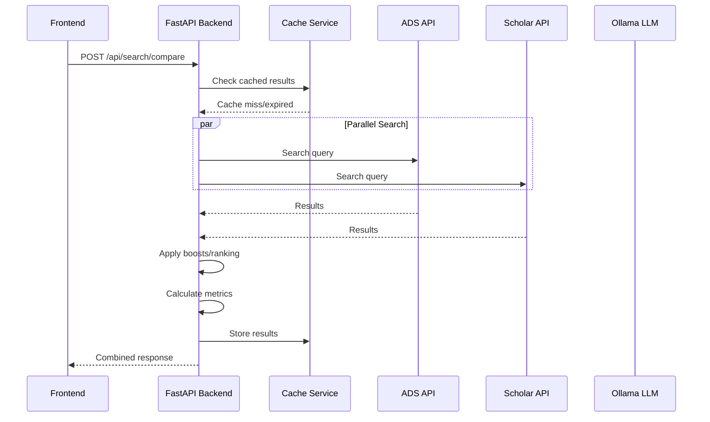
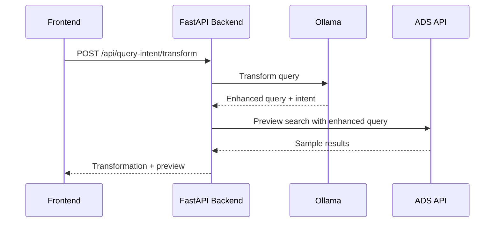

# Search Comparisons Tool - Complete Documentation

## Overview

The Search Comparisons Tool is a comprehensive web application designed to compare search results across multiple scholarly search engines, collect relevance judgments, test changes to the ADS/SciX search experience, and analyze search performance metrics. It serves three primary audiences: users providing relevance judgments, technical staff adding features, and scientists testing algorithm changes.

## Table of Contents

1. [Quick Start Guide](#quick-start-guide)
2. [User Guide: Relevance Judgment Collection](#user-guide-relevance-judgment-collection)
3. [Developer Guide: Adding Features](#developer-guide-adding-features)
4. [Scientist Guide: Algorithm Testing](#scientist-guide-algorithm-testing)
5. [Architecture Overview](#architecture-overview)
6. [Deployment & Maintenance](#deployment--maintenance)
7. [Troubleshooting](#troubleshooting)

---

## Quick Start Guide

### Prerequisites
- Python 3.8+
- Node.js and npm/pnpm
- API keys for external services (ADS, Web of Science, etc.)

### Local Development Setup
```bash
# Clone and navigate to repository
git clone https://github.com/adsabs/search-comparisons.git
cd search-comparisons

# Set up environment variables
cp backend/.env.example backend/.env
# Edit backend/.env with your API keys

# Install frontend dependencies
cd frontend && npm install && cd ..

# Start both frontend and backend
./startup.sh

# Access the application
# Frontend: http://localhost:3001
# Backend API: http://localhost:8001
```

### Alternative: Manual Development
```bash
# Backend development
cd backend
python -m uvicorn app.main:app --reload --host 0.0.0.0 --port 8001

# Frontend development (separate terminal)
cd frontend
pnpm install
pnpm dev
```

---

## User Guide: Relevance Judgment Collection

### What You Do
As a relevance judgment user, you evaluate search results from multiple engines to help improve search quality. Your judgments feed into metrics that guide search algorithm development.

### Interface Overview
The web interface provides:
- **Search Comparison Tab**: Enter queries and compare results side-by-side
- **Query Intent Tab**: View how the system transforms your queries for ADS
- **Metrics Tab**: See performance metrics based on your judgments

### Step-by-Step Workflow

#### 1. Starting a Search Comparison
1. Open http://localhost:3001 in your browser
2. Navigate to the "Search Comparison" tab
3. Enter your search query in the text field
4. Select which search engines to compare:
   - **ADS**: Astrophysics Data System
   - **Google Scholar**: Academic search engine
   - **Semantic Scholar**: AI-powered academic search
   - **Web of Science**: Comprehensive academic database
5. Set the number of results to retrieve (default: 20)
6. Click "Search"

#### 2. Evaluating Results
Each search engine's results appear in separate columns. For each result:

1. **Read the title, authors, and abstract** to understand the paper's content
2. **Click the star rating** (⭐) to assign relevance:
   - **3 stars**: Highly relevant, must-read paper
   - **2 stars**: Relevant and helpful
   - **1 star**: Marginally relevant
   - **0 stars**: Not relevant

3. **Visual feedback**: Results change color based on your rating:
   - Green: Relevant (2-3 stars)
   - Yellow: Marginally relevant (1 star)
   - Red: Not relevant (0 stars)

#### 3. Best Practices for Judgment
- **Judge at least the first 10 results** per engine
- **Be consistent** with your rating scale across queries
- **Consider the query intent**: What would a researcher actually want?
- **Focus on content relevance**, not just keyword matching
- **Judge independently** per engine - don't let one engine's ranking influence another

#### 4. Understanding Query Transformations
- Switch to the "Query Intent" tab to see how the system rewrites your query
- The LLM-powered transformation makes queries more specific for academic search
- This helps you understand why certain results appear

#### 5. Monitoring Your Impact
- Visit the "Metrics" tab to see how your judgments affect performance
- Metrics include:
  - **nDCG@10**: Normalized Discounted Cumulative Gain (higher is better)
  - **Precision@10**: Proportion of relevant results in top 10
  - **Recall**: How many relevant papers were found
  - **Jaccard Similarity**: Overlap between engine results

### Common Scenarios

#### Judging Similar Papers
When multiple engines return similar papers:
- Judge each independently based on relevance to the query
- Don't penalize an engine for returning fewer unique results
- Focus on whether the specific result answers the research question

#### Handling Edge Cases
- **Preprints vs. Published Papers**: Generally rate published papers slightly higher
- **Review Papers**: Often highly relevant for broad queries
- **Conference Papers vs. Journal Articles**: Rate based on content quality and relevance
- **Non-English Papers**: Rate based on relevance; language is secondary

#### Query Types
- **Broad Exploratory Queries**: Accept wider range of relevant results
- **Specific Technical Queries**: Be more stringent about exact topic match
- **Author/Citation Queries**: Focus on accuracy of bibliographic information

---

## Developer Guide: Adding Features

### Architecture Overview
The application follows a modern microservices architecture:

```
Frontend (React + TypeScript + MUI)
↓ HTTP/REST API
Backend (FastAPI + Python)
↓ External APIs
Search Engines (ADS, Scholar, etc.) + LLM (Ollama)
```

### Backend Structure
```
backend/app/
├── api/           # Pydantic models and API schemas
├── routes/        # FastAPI route handlers
├── services/      # Business logic and external integrations
├── core/          # Configuration and database setup
├── utils/         # Shared utilities and helpers
└── main.py        # Application entry point
```

### Key Services

#### SearchService (`services/search_service.py`)
Main orchestrator for search operations:
- Coordinates parallel requests to multiple search engines
- Handles fallback logic when engines fail
- Manages caching and timeout behavior
- Delegates to ComparisonService for metrics

#### Individual Engine Services
Each search engine has its own service module:
- `ads_service.py`: ADS/SAO search integration
- `scholar_service.py`: Google Scholar integration
- `semantic_scholar_service.py`: Semantic Scholar API
- `web_of_science_service.py`: Web of Science integration

#### Supporting Services
- `boost_service.py`: Post-retrieval ranking adjustments
- `comparison_service.py`: Metrics calculation (nDCG, Jaccard, etc.)
- `unified_cache_service.py`: In-memory caching with TTL
- `query_intent/service.py`: LLM-powered query transformation

### Adding a New Search Engine

#### 1. Create Service Module
Create `services/your_engine_service.py`:

```python
import asyncio
import logging
from typing import List, Optional
import httpx
from app.api.search_models import SearchResult

logger = logging.getLogger(__name__)

class YourEngineService:
    def __init__(self, api_key: Optional[str] = None):
        self.api_key = api_key
        self.base_url = "https://your-api.example.com"
        self.timeout = 30.0
    
    async def get_your_engine_results(
        self, 
        query: str, 
        fields: List[str],
        max_results: int = 20
    ) -> List[SearchResult]:
        """Fetch results from Your Engine API."""
        try:
            async with httpx.AsyncClient(timeout=self.timeout) as client:
                params = {
                    "q": query,
                    "rows": max_results,
                    "api_key": self.api_key
                }
                
                response = await client.get(
                    f"{self.base_url}/search", 
                    params=params
                )
                response.raise_for_status()
                
                data = response.json()
                return self._parse_results(data)
                
        except Exception as e:
            logger.error(f"Your Engine search failed: {e}")
            return []
    
    def _parse_results(self, data: dict) -> List[SearchResult]:
        """Convert API response to SearchResult objects."""
        results = []
        for item in data.get("results", []):
            result = SearchResult(
                id=item.get("id"),
                title=item.get("title", ""),
                authors=item.get("authors", []),
                abstract=item.get("abstract", ""),
                publication_date=item.get("date"),
                url=item.get("url"),
                citation_count=item.get("citations", 0),
                source="your_engine"
            )
            results.append(result)
        return results
```

#### 2. Register in Main Application
Add to `main.py`:

```python
from app.services.your_engine_service import YourEngineService

# In create_app()
app.state.your_engine_service = YourEngineService(
    api_key=settings.YOUR_ENGINE_API_KEY
)
```

#### 3. Update SearchService Configuration
In `services/search_service.py`, add to `SERVICE_CONFIG`:

```python
SERVICE_CONFIG = {
    "your_engine": {
        "priority": 3,
        "timeout": 30.0,
        "fallback_available": False
    },
    # ... existing configs
}
```

#### 4. Add Frontend Support
In `frontend/src/types/search.ts`, add to the `SearchEngine` enum:

```typescript
export enum SearchEngine {
    ADS = "ads",
    SCHOLAR = "scholar", 
    SEMANTIC_SCHOLAR = "semantic_scholar",
    WEB_OF_SCIENCE = "web_of_science",
    YOUR_ENGINE = "your_engine"
}
```

Update `frontend/src/components/SearchEngineSelector.tsx` to include the new option.

### Adding New Metrics

#### 1. Implement Metric Function
In `services/comparison_service.py`:

```python
def calculate_your_metric(
    results_a: List[SearchResult],
    results_b: List[SearchResult], 
    judgments: Dict[str, float] = None
) -> float:
    """Calculate your custom metric."""
    # Implementation here
    return metric_value
```

#### 2. Register in Metric Switch
Add to the metric calculation switch in `ComparisonService.compare_results()`:

```python
elif metric == "your_metric":
    value = self.calculate_your_metric(results_a, results_b, judgments)
```

#### 3. Update Frontend
Add to `frontend/src/components/MetricSelector.tsx`:

```typescript
const availableMetrics = [
    { value: "jaccard", label: "Jaccard Similarity" },
    { value: "ndcg", label: "nDCG@10" },
    { value: "your_metric", label: "Your Metric" }
];
```

### Adding Boost/Ranking Experiments

Boost configurations allow post-retrieval re-ranking of search results. Add new boost types in `services/boost_service.py`:

```python
def apply_your_boost(
    results: List[SearchResult], 
    boost_factor: float
) -> List[SearchResult]:
    """Apply your custom boost to results."""
    for result in results:
        # Calculate boost score
        boost_score = calculate_your_boost_score(result, boost_factor)
        result.boost_score = boost_score
    
    # Re-sort by boost score
    return sorted(results, key=lambda x: x.boost_score, reverse=True)
```

Register in `apply_all_boosts()`:

```python
if boost_config.your_boost:
    results = apply_your_boost(results, boost_config.your_boost)
```

### Testing

#### Unit Tests
Create tests in `backend/tests/test_services/`:

```python
import pytest
from app.services.your_engine_service import YourEngineService

@pytest.mark.asyncio
async def test_your_engine_search():
    service = YourEngineService(api_key="test_key")
    results = await service.get_your_engine_results(
        query="test query",
        fields=["title", "author"],
        max_results=10
    )
    assert isinstance(results, list)
    assert len(results) <= 10
```

#### Integration Tests
Test the full API endpoint:

```python
def test_search_with_your_engine(client):
    response = client.post("/api/search/compare", json={
        "query": "test query",
        "sources": ["ads", "your_engine"],
        "max_results": 10
    })
    assert response.status_code == 200
    data = response.json()
    assert "your_engine" in data["results"]
```

#### Run Tests
```bash
# All tests
pytest backend/tests/

# Specific test file
pytest backend/tests/test_services/test_your_engine_service.py

# With coverage
pytest backend/tests/ --cov=backend/app --cov-report=html
```

---

## Scientist Guide: Algorithm Testing

### Overview
This tool enables systematic comparison of search algorithms, ranking functions, and parameter configurations across multiple search engines. You can test hypotheses about search relevance and collect quantitative metrics.

### Key Capabilities
- **Parallel multi-engine search**: Compare ADS, Google Scholar, Semantic Scholar, Web of Science
- **Configurable ranking boosts**: Citation count, recency, document type, field weights
- **LLM query transformation**: Test query rewriting effectiveness
- **Relevance metrics**: nDCG, precision, recall, Jaccard similarity
- **Reproducible experiments**: Caching and parameter versioning

### API Reference

#### Core Search Endpoint
**POST** `/api/search/compare`

```json
{
  "query": "machine learning astrophysics",
  "sources": ["ads", "scholar", "semantic_scholar"],
  "metrics": ["ndcg@10", "precision@10", "jaccard@10"],
  "fields": ["title", "author", "abstract", "citation_count"],
  "max_results": 50,
  "useTransformedQuery": true,
  "originalQuery": "machine learning astrophysics", 
  "boost_config": {
    "citation_boost": 1.5,
    "recency_boost": 0.8,
    "doctype_boosts": {
      "article": 1.0,
      "inproceedings": 0.9,
      "phdthesis": 0.7
    },
    "field_boosts": {
      "keyword": 0.5,
      "abstract": 0.3
    },
    "adsQueryFields": {
      "title": 50,
      "author": 30,
      "keyword": 20
    }
  }
}
```

**Response:**
```json
{
  "results": {
    "ads": [
      {
        "id": "2023arXiv230512345H",
        "title": "Machine Learning Applications in Astrophysics",
        "authors": ["Smith, J.", "Doe, A."],
        "abstract": "...",
        "citation_count": 45,
        "publication_date": "2023-05-15",
        "url": "https://ui.adsabs.harvard.edu/abs/2023arXiv230512345H",
        "source": "ads",
        "score": 0.95,
        "boost_score": 1.42
      }
    ],
    "scholar": [...],
    "semantic_scholar": [...]
  },
  "comparison": {
    "ndcg@10": {
      "ads": 0.762,
      "scholar": 0.543,
      "semantic_scholar": 0.691
    },
    "precision@10": {
      "ads": 0.8,
      "scholar": 0.6, 
      "semantic_scholar": 0.7
    },
    "jaccard@10": {
      "ads_scholar": 0.23,
      "ads_semantic_scholar": 0.31,
      "scholar_semantic_scholar": 0.18
    }
  },
  "field_weights": {
    "qf": "title^50 author^30 keyword^20",
    "field_boosts": {
      "keyword": 0.5,
      "abstract": 0.3
    }
  }
}
```

#### Query Intent Transformation
**POST** `/api/query-intent/transform`

```json
{
  "query": "exoplanet atmospheres"
}
```

**Response:**
```json
{
  "transformed_query": "exoplanet atmosphere composition spectroscopy transit",
  "intent": "research_specific",
  "confidence": 0.87,
  "explanation": "Added domain-specific terms for atmospheric research",
  "ads_preview": {
    "num_found": 1247,
    "top_results": [...]
  }
}
```

#### Retrieving Judgments
**GET** `/api/quepid/judgments/{case_id}?query=exoplanet%20atmospheres`

Returns relevance judgments for computing metrics:
```json
{
  "judgments": {
    "2023ApJ...123..456B": 3,
    "2022A&A...789..012C": 2,
    "2021MNRAS.456..789D": 1,
    "2020AJ....159..123E": 0
  }
}
```

### Experimental Design Patterns

#### 1. Parameter Sweep Experiments
Test different boost configurations systematically:

```python
import requests
import pandas as pd
from itertools import product

# Define parameter ranges
citation_boosts = [1.0, 1.2, 1.5, 2.0]
recency_boosts = [0.5, 0.8, 1.0, 1.2]
queries = ["exoplanet atmospheres", "dark matter", "gravitational waves"]

results = []

for query, cite_boost, rec_boost in product(queries, citation_boosts, recency_boosts):
    config = {
        "query": query,
        "sources": ["ads", "scholar"],
        "metrics": ["ndcg@10", "precision@10"],
        "boost_config": {
            "citation_boost": cite_boost,
            "recency_boost": rec_boost
        }
    }
    
    response = requests.post("http://localhost:8001/api/search/compare", json=config)
    data = response.json()
    
    results.append({
        "query": query,
        "citation_boost": cite_boost,
        "recency_boost": rec_boost,
        "ads_ndcg": data["comparison"]["ndcg@10"]["ads"],
        "scholar_ndcg": data["comparison"]["ndcg@10"]["scholar"]
    })

# Analyze results
df = pd.DataFrame(results)
best_config = df.loc[df["ads_ndcg"].idxmax()]
print(f"Best configuration: {best_config}")
```

#### 2. A/B Testing Query Transformations
Compare original vs. transformed queries:

```python
queries = ["machine learning", "stellar evolution", "cosmic rays"]
results = []

for query in queries:
    # Test original query
    original_config = {
        "query": query,
        "sources": ["ads"],
        "useTransformedQuery": False,
        "metrics": ["ndcg@10"]
    }
    
    # Test transformed query  
    transformed_config = {
        "query": query,
        "sources": ["ads"],
        "useTransformedQuery": True,
        "metrics": ["ndcg@10"]
    }
    
    original_response = requests.post("http://localhost:8001/api/search/compare", json=original_config)
    transformed_response = requests.post("http://localhost:8001/api/search/compare", json=transformed_config)
    
    results.append({
        "query": query,
        "original_ndcg": original_response.json()["comparison"]["ndcg@10"]["ads"],
        "transformed_ndcg": transformed_response.json()["comparison"]["ndcg@10"]["ads"],
        "improvement": transformed_response.json()["comparison"]["ndcg@10"]["ads"] - 
                      original_response.json()["comparison"]["ndcg@10"]["ads"]
    })

df = pd.DataFrame(results)
print(f"Average improvement: {df['improvement'].mean():.3f}")
```

#### 3. Solr Field Weight Optimization
Test different Solr qf configurations:

```python
field_configs = [
    {"title": 50, "author": 30, "keyword": 20},
    {"title": 80, "author": 20, "keyword": 10}, 
    {"title": 30, "author": 50, "keyword": 30},
    {"title": 60, "author": 40, "abstract": 20}
]

for config in field_configs:
    request_config = {
        "query": "neutron star mergers",
        "sources": ["ads"],
        "metrics": ["ndcg@10", "precision@10"],
        "boost_config": {
            "adsQueryFields": config
        }
    }
    
    response = requests.post("http://localhost:8001/api/search/compare", json=request_config)
    data = response.json()
    
    print(f"Config {config}: nDCG={data['comparison']['ndcg@10']['ads']:.3f}")
```

### Advanced Configurations

#### Document Type Preferences
Adjust ranking based on publication type:

```json
{
  "boost_config": {
    "doctype_boosts": {
      "article": 1.0,
      "inproceedings": 0.9,
      "book": 0.8,
      "phdthesis": 0.7,
      "mastersthesis": 0.5,
      "misc": 0.3
    }
  }
}
```

#### Time-Based Boosting
Prefer recent publications:

```json
{
  "boost_config": {
    "recency_boost": 1.5,  # Boost recent papers
    "recency_window_years": 5  # Only boost papers from last 5 years
  }
}
```

#### Combined Field and Citation Boosting
```json
{
  "boost_config": {
    "citation_boost": 1.3,
    "field_boosts": {
      "keyword": 0.8,
      "abstract": 0.5
    },
    "adsQueryFields": {
      "title": 60,
      "author": 40,
      "keyword": 25,
      "abstract": 15
    }
  }
}
```

### Metrics Interpretation

#### nDCG (Normalized Discounted Cumulative Gain)
- **Range**: 0.0 to 1.0 (higher is better)
- **Interpretation**: 
  - 0.8+: Excellent ranking
  - 0.6-0.8: Good ranking  
  - 0.4-0.6: Fair ranking
  - <0.4: Poor ranking
- **Use case**: Overall ranking quality assessment

#### Precision@K
- **Range**: 0.0 to 1.0 (higher is better)
- **Interpretation**: Fraction of top-K results that are relevant
- **Use case**: Quality of top results

#### Recall@K  
- **Range**: 0.0 to 1.0 (higher is better)
- **Interpretation**: Fraction of all relevant documents found in top-K
- **Use case**: Completeness of search

#### Jaccard Similarity
- **Range**: 0.0 to 1.0 (higher means more overlap)
- **Interpretation**: 
  - 0.3+: High overlap between engines
  - 0.1-0.3: Moderate overlap
  - <0.1: Low overlap (engines finding different results)
- **Use case**: Engine diversity analysis

### Reproducibility and Versioning

#### Experiment Configuration Files
Save configurations as JSON for reproducibility:

```json
{
  "experiment_name": "citation_boost_sweep_2024_01",
  "description": "Testing citation boost effects on nDCG",
  "timestamp": "2024-01-15T10:30:00Z",
  "git_commit": "a1b2c3d4",
  "test_queries": [
    "exoplanet atmospheres",
    "dark matter detection", 
    "gravitational wave astronomy"
  ],
  "boost_config": {
    "citation_boost": 1.5,
    "recency_boost": 0.8,
    "adsQueryFields": {
      "title": 50,
      "author": 30
    }
  },
  "expected_results": {
    "avg_ndcg_improvement": 0.05
  }
}
```

#### Cache Management
For reproducible experiments:

```python
# Disable cache for fresh results
import requests

# Clear cache (requires restart)
requests.post("http://localhost:8001/api/admin/clear-cache")

# Or use cache-busting parameter
config["cache_bust"] = "experiment_2024_01_v2"
```

### Statistical Analysis

#### Significance Testing
```python
from scipy import stats
import numpy as np

# Compare two configurations
config_a_scores = [0.75, 0.68, 0.82, 0.71, 0.79]  # nDCG scores
config_b_scores = [0.78, 0.72, 0.85, 0.74, 0.81]

# Paired t-test
t_stat, p_value = stats.ttest_rel(config_b_scores, config_a_scores)
print(f"T-statistic: {t_stat:.3f}")
print(f"P-value: {p_value:.3f}")
print(f"Significant improvement: {p_value < 0.05}")
```

#### Effect Size Calculation
```python
def cohen_d(group1, group2):
    """Calculate Cohen's d for effect size."""
    pooled_std = np.sqrt(((len(group1) - 1) * np.var(group1, ddof=1) + 
                         (len(group2) - 1) * np.var(group2, ddof=1)) / 
                        (len(group1) + len(group2) - 2))
    return (np.mean(group1) - np.mean(group2)) / pooled_std

effect_size = cohen_d(config_b_scores, config_a_scores)
print(f"Effect size (Cohen's d): {effect_size:.3f}")
```

---

## Architecture Overview

### System Components

#### Frontend (React + TypeScript)
- **Framework**: React 18 with Vite build system
- **UI Library**: Material-UI (MUI) for components
- **State Management**: Local component state + Context API
- **Routing**: React Router for navigation
- **API Client**: Axios for HTTP requests

**Key Components:**
- `SearchComparison.tsx`: Main search interface
- `QueryIntent.tsx`: LLM query transformation interface  
- `MetricsDashboard.tsx`: Results analysis and visualization
- `ResultCard.tsx`: Individual search result display with judgment controls

#### Backend (FastAPI + Python)
- **Framework**: FastAPI with async/await support
- **Database**: SQLite for local storage, Quepid integration for judgments
- **Caching**: In-memory LRU cache with TTL
- **HTTP Client**: httpx for async external API calls
- **LLM Integration**: Ollama for local language models

**Service Architecture:**
```
┌─────────────────┐    ┌─────────────────┐    ┌─────────────────┐
│   SearchService │────│  ComparisonSvc  │────│   BoostService  │
└─────────────────┘    └─────────────────┘    └─────────────────┘
         │                       │                       │
         ▼                       ▼                       ▼
┌─────────────────┐    ┌─────────────────┐    ┌─────────────────┐
│   ADS Service   │    │ Scholar Service │    │   Cache Service │
└─────────────────┘    └─────────────────┘    └─────────────────┘
```

#### External Integrations
- **ADS API**: Harvard's Astrophysics Data System
- **Google Scholar**: Academic search (API + scraping fallback)
- **Semantic Scholar**: AI-powered academic search
- **Web of Science**: Thomson Reuters academic database
- **Quepid**: Relevance judgment collection platform
- **Ollama**: Local LLM inference for query transformation

### Data Flow

#### Search Request Flow


#### Query Intent Flow


### Data Models

#### Core SearchResult Model
```python
class SearchResult(BaseModel):
    id: str
    title: str
    authors: List[str]
    abstract: Optional[str]
    publication_date: Optional[str]
    url: Optional[str]
    citation_count: Optional[int]
    source: str
    score: Optional[float]
    boost_score: Optional[float]
    metadata: Dict[str, Any] = {}
```

#### BoostConfig Model
```python
class BoostConfig(BaseModel):
    citation_boost: Optional[float] = 1.0
    recency_boost: Optional[float] = 1.0
    doctype_boosts: Optional[Dict[str, float]] = {}
    field_boosts: Optional[Dict[str, float]] = {}
    adsQueryFields: Optional[Dict[str, int]] = {}
```

#### SearchRequest Model
```python
class SearchRequestWithBoosts(BaseModel):
    query: str
    sources: List[str] = ["ads", "scholar"]
    metrics: List[str] = ["ndcg@10"]
    fields: List[str] = ["title", "author", "abstract"]
    max_results: int = 20
    useTransformedQuery: bool = False
    originalQuery: Optional[str] = None
    boost_config: Optional[BoostConfig] = None
```

### Security Considerations

#### API Key Management
- Store API keys in environment variables
- Use separate keys for development/production
- Implement key rotation procedures
- Monitor API usage and rate limits

#### CORS Configuration
- Restrict origins in production
- Configure appropriate headers
- Validate content types

#### Rate Limiting
- Implement per-IP rate limiting
- Set reasonable request size limits
- Monitor for abuse patterns

#### Data Privacy
- No persistent storage of search queries in logs
- Anonymize user judgment data
- Secure external API communications

---

## Deployment & Maintenance

### Production Deployment

#### Docker Compose (Recommended)
```yaml
version: '3.8'
services:
  backend:
    build: 
      context: ./backend
      dockerfile: Dockerfile
    ports:
      - "8001:8000"
    environment:
      - ADS_API_KEY=${ADS_API_KEY}
      - WEB_OF_SCIENCE_API_KEY=${WEB_OF_SCIENCE_API_KEY}
      - QUEPID_API_TOKEN=${QUEPID_API_TOKEN}
      - LOG_LEVEL=INFO
    volumes:
      - ./backend/logs:/app/logs
    
  frontend:
    build:
      context: ./frontend
      dockerfile: Dockerfile
    ports:
      - "3001:80"
    depends_on:
      - backend
    
  ollama:
    image: ollama/ollama:latest
    ports:
      - "11434:11434"
    volumes:
      - ollama_data:/root/.ollama
    environment:
      - OLLAMA_HOST=0.0.0.0

volumes:
  ollama_data:
```

#### Environment Configuration
Create a `.env` file:
```bash
# Required API Keys
ADS_API_KEY=your_ads_api_key_here
WEB_OF_SCIENCE_API_KEY=your_wos_key_here
QUEPID_API_TOKEN=your_quepid_token_here

# Optional Configuration
LOG_LEVEL=INFO
CACHE_TTL_SECONDS=3600
MAX_CACHE_SIZE=1000
OLLAMA_BASE_URL=http://ollama:11434

# Frontend Configuration
REACT_APP_API_URL=http://localhost:8001
REACT_APP_ENVIRONMENT=production
```

#### Cloud Deployment (AWS/GCP/Azure)

**Container Service Deployment:**
```bash
# Build and tag images
docker build -t search-comparisons-backend ./backend
docker build -t search-comparisons-frontend ./frontend

# Push to container registry
docker tag search-comparisons-backend your-registry/search-comparisons-backend:latest
docker push your-registry/search-comparisons-backend:latest

# Deploy using your cloud provider's container service
# (ECS, GKE, Container Instances, etc.)
```

**Render.com Deployment:**
The repository includes `render.yaml` for one-click deployment:
```yaml
services:
  - type: web
    name: search-comparisons-backend
    env: python
    buildCommand: "pip install -r requirements.txt"
    startCommand: "uvicorn app.main:app --host 0.0.0.0 --port $PORT"
    envVars:
      - key: ADS_API_KEY
        sync: false
      - key: WEB_OF_SCIENCE_API_KEY  
        sync: false
```

### Monitoring and Logging

#### Application Logs
```python
# Configure logging in backend/app/core/config.py
import logging
from logging.handlers import RotatingFileHandler

# Rotating file handler
file_handler = RotatingFileHandler(
    'logs/app.log', 
    maxBytes=10485760,  # 10MB
    backupCount=5
)
file_handler.setFormatter(logging.Formatter(
    '%(asctime)s %(levelname)s %(name)s %(message)s'
))

# Console handler
console_handler = logging.StreamHandler()
console_handler.setFormatter(logging.Formatter(
    '%(asctime)s %(levelname)s %(name)s %(message)s'
))

# Root logger
root_logger = logging.getLogger()
root_logger.setLevel(logging.INFO)
root_logger.addHandler(file_handler)
root_logger.addHandler(console_handler)
```

#### Key Metrics to Monitor
- **API Response Times**: Track latency for each search engine
- **Error Rates**: Monitor failed requests and external API errors
- **Cache Hit Rates**: Optimize caching effectiveness
- **Search Engine Availability**: Track uptime of external services
- **Query Volume**: Monitor usage patterns
- **Judgment Collection Rate**: Track relevance evaluation progress

#### Health Check Endpoints
```python
@app.get("/health")
async def health_check():
    """Basic health check endpoint."""
    return {"status": "healthy", "timestamp": datetime.utcnow()}

@app.get("/health/deep")
async def deep_health_check():
    """Comprehensive health check including external services."""
    checks = {}
    
    # Check database connection
    try:
        # Database check logic
        checks["database"] = "healthy"
    except Exception:
        checks["database"] = "unhealthy"
    
    # Check external APIs
    for service in ["ads", "scholar", "semantic_scholar"]:
        try:
            # Service availability check
            checks[service] = "healthy"
        except Exception:
            checks[service] = "unhealthy"
    
    return {"checks": checks, "timestamp": datetime.utcnow()}
```

### Backup and Recovery

#### Database Backup
```bash
# Backup SQLite database (if using local storage)
cp backend/app.db backup/app_$(date +%Y%m%d_%H%M%S).db

# Backup Quepid judgments (via API)
curl -H "Authorization: Bearer $QUEPID_API_TOKEN" \
     "https://quepid.com/api/cases/$CASE_ID/judgements" \
     > backup/judgments_$(date +%Y%m%d).json
```

#### Configuration Backup
```bash
# Backup environment and configuration
tar -czf backup/config_$(date +%Y%m%d).tar.gz \
    .env docker-compose.yml backend/app/core/config.py
```

### Performance Optimization

#### Backend Optimizations
```python
# Connection pooling for external APIs
import httpx

class OptimizedHTTPService:
    def __init__(self):
        self.client = httpx.AsyncClient(
            timeout=30.0,
            limits=httpx.Limits(
                max_keepalive_connections=20,
                max_connections=100
            )
        )
    
    async def close(self):
        await self.client.aclose()

# Cache optimization
from functools import lru_cache
from typing import Optional

@lru_cache(maxsize=1000)
def expensive_computation(param: str) -> str:
    # Cached expensive operations
    pass
```

#### Frontend Optimizations
```typescript
// Lazy loading of components
import { lazy, Suspense } from 'react';

const MetricsDashboard = lazy(() => import('./MetricsDashboard'));

// Memoization for expensive renders
import { memo, useMemo } from 'react';

const ResultCard = memo(({ result }: { result: SearchResult }) => {
  const formattedAuthors = useMemo(
    () => result.authors.join(', '),
    [result.authors]
  );
  
  return <div>{/* Component JSX */}</div>;
});
```

#### Database Optimizations
```sql
-- Index frequently queried fields
CREATE INDEX idx_search_results_source ON search_results(source);
CREATE INDEX idx_search_results_query ON search_results(query_hash);
CREATE INDEX idx_judgments_query_doc ON judgments(query_id, document_id);
```

### Troubleshooting Common Issues

#### External API Failures
```python
# Implement circuit breaker pattern
class CircuitBreaker:
    def __init__(self, failure_threshold=5, recovery_timeout=60):
        self.failure_threshold = failure_threshold
        self.recovery_timeout = recovery_timeout
        self.failure_count = 0
        self.last_failure_time = None
        self.state = "CLOSED"  # CLOSED, OPEN, HALF_OPEN
    
    async def call(self, func, *args, **kwargs):
        if self.state == "OPEN":
            if time.time() - self.last_failure_time > self.recovery_timeout:
                self.state = "HALF_OPEN"
            else:
                raise Exception("Circuit breaker is OPEN")
        
        try:
            result = await func(*args, **kwargs)
            self.success()
            return result
        except Exception as e:
            self.failure()
            raise e
    
    def success(self):
        self.failure_count = 0
        self.state = "CLOSED"
    
    def failure(self):
        self.failure_count += 1
        self.last_failure_time = time.time()
        if self.failure_count >= self.failure_threshold:
            self.state = "OPEN"
```

#### Memory Issues
```python
# Memory monitoring
import psutil

@app.middleware("http")
async def memory_monitor(request, call_next):
    process = psutil.Process()
    memory_before = process.memory_info().rss / 1024 / 1024  # MB
    
    response = await call_next(request)
    
    memory_after = process.memory_info().rss / 1024 / 1024  # MB
    if memory_after - memory_before > 50:  # 50MB increase
        logger.warning(f"High memory usage increase: {memory_after - memory_before:.2f}MB")
    
    return response
```

#### Cache Issues
```python
# Cache debugging
def cache_stats():
    """Return cache statistics for monitoring."""
    return {
        "size": len(cache._data),
        "hits": cache.hits,
        "misses": cache.misses,
        "hit_rate": cache.hits / (cache.hits + cache.misses) if (cache.hits + cache.misses) > 0 else 0
    }

@app.get("/api/admin/cache/stats")
async def get_cache_stats():
    return cache_stats()

@app.post("/api/admin/cache/clear")
async def clear_cache():
    cache.clear()
    return {"message": "Cache cleared"}
```

---

## Troubleshooting

### Common Issues and Solutions

#### API Connection Issues

**Problem**: External search engines returning errors or timeouts
```
ERROR: ADS API request failed: HTTPStatusError 429
```

**Solutions**:
1. Check API key validity and quotas
2. Implement exponential backoff:
```python
import asyncio
from tenacity import retry, stop_after_attempt, wait_exponential

@retry(stop=stop_after_attempt(3), wait=wait_exponential(multiplier=1, min=4, max=10))
async def api_request_with_retry(url, params):
    async with httpx.AsyncClient() as client:
        response = await client.get(url, params=params)
        response.raise_for_status()
        return response.json()
```

3. Check rate limiting configuration
4. Verify network connectivity to external services

#### Frontend Build Issues

**Problem**: Frontend fails to build or connect to backend
```
Network Error: Request failed with status code 500
```

**Solutions**:
1. Verify environment variables:
```bash
# Check frontend/.env
REACT_APP_API_URL=http://localhost:8001
```

2. Ensure backend is running and accessible:
```bash
curl http://localhost:8001/health
```

3. Check CORS configuration in backend:
```python
app.add_middleware(
    CORSMiddleware,
    allow_origins=["http://localhost:3000", "http://localhost:3001"],
    allow_credentials=True,
    allow_methods=["*"],
    allow_headers=["*"],
)
```

#### LLM Service Issues

**Problem**: Query intent transformation fails
```
ERROR: Ollama connection refused
```

**Solutions**:
1. Ensure Ollama container is running:
```bash
docker-compose ps ollama
```

2. Check model availability:
```bash
curl http://localhost:11434/api/tags
```

3. Download required models:
```bash
docker exec -it ollama_container ollama pull mistral:7b
```

#### Database Connection Issues

**Problem**: SQLite database locked or corrupted
```
ERROR: database is locked
```

**Solutions**:
1. Check for multiple processes accessing the database
2. Restart the application
3. For corruption, restore from backup:
```bash
mv app.db app.db.corrupt
cp backup/app_latest.db app.db
```

#### Performance Issues

**Problem**: Slow search response times

**Solutions**:
1. Check cache hit rates:
```bash
curl http://localhost:8001/api/admin/cache/stats
```

2. Monitor external API response times
3. Reduce concurrent requests if APIs are rate-limited:
```python
# In SearchService
semaphore = asyncio.Semaphore(3)  # Limit concurrent requests

async def search_with_limit(engine, query):
    async with semaphore:
        return await engine.search(query)
```

4. Enable query result caching:
```python
@lru_cache(maxsize=100)
def cached_search(query_hash: str, sources: str):
    # Cache based on query and sources
    pass
```

### Debug Mode Configuration

#### Backend Debug Mode
```python
# In backend/app/main.py
if settings.DEBUG:
    # Enable debug logging
    logging.getLogger().setLevel(logging.DEBUG)
    
    # Add debug middleware
    @app.middleware("http")
    async def debug_requests(request, call_next):
        start_time = time.time()
        response = await call_next(request)
        process_time = time.time() - start_time
        logger.debug(f"{request.method} {request.url} - {process_time:.2f}s")
        return response
```

#### Frontend Debug Mode
```typescript
// In frontend/src/config/api.ts
const API_CONFIG = {
  baseURL: process.env.REACT_APP_API_URL || 'http://localhost:8001',
  timeout: 30000,
  debug: process.env.NODE_ENV === 'development'
};

// Add request/response interceptors for debugging
if (API_CONFIG.debug) {
  axios.interceptors.request.use(request => {
    console.log('API Request:', request);
    return request;
  });
  
  axios.interceptors.response.use(
    response => {
      console.log('API Response:', response);
      return response;
    },
    error => {
      console.error('API Error:', error);
      return Promise.reject(error);
    }
  );
}
```

### Error Tracking

#### Structured Error Logging
```python
import structlog

logger = structlog.get_logger()

try:
    result = await external_api_call()
except Exception as e:
    logger.error(
        "External API call failed",
        api="ads",
        query=query,
        error=str(e),
        traceback=traceback.format_exc()
    )
    raise
```

#### Error Aggregation
```python
from collections import defaultdict
from datetime import datetime, timedelta

class ErrorTracker:
    def __init__(self):
        self.errors = defaultdict(list)
    
    def log_error(self, error_type: str, details: dict):
        self.errors[error_type].append({
            "timestamp": datetime.utcnow(),
            "details": details
        })
    
    def get_error_summary(self, hours: int = 24):
        cutoff = datetime.utcnow() - timedelta(hours=hours)
        summary = {}
        
        for error_type, errors in self.errors.items():
            recent_errors = [e for e in errors if e["timestamp"] > cutoff]
            summary[error_type] = len(recent_errors)
        
        return summary

# Global error tracker
error_tracker = ErrorTracker()

@app.get("/api/admin/errors")
async def get_error_summary():
    return error_tracker.get_error_summary()
```

This comprehensive documentation should enable your team to effectively use, maintain, and extend the Search Comparisons Tool. Each section is tailored to its specific audience while providing the depth needed for ongoing development and research activities.
